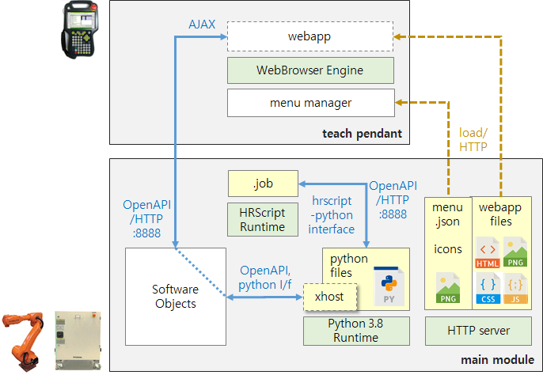

# 1.2 Hi6 플러그인 앱(plugin-app)의 개념
Hi6 앱은 main module 내에서 동작하는 python 3 스크립트와, 티치펜던트 내에서 U/I 동작을 수행하는 javascript 기반 웹 소프트웨어로 구성됩니다.

만일 U/I 가 없는 앱이라면 python 스크립트만으로 구성될 수도 있습니다.

여러 개의 python 파일들과 웹 앱(webapp) 파일들은 main module 내의 하나의 폴더 밑에 설치됩니다.

## python 스크립트
로봇 제어기의 특정한 이벤트에 의해 혹은 주기적으로 호출될 수도 있습니다. 또한 지정한 python 함수가 .job 파일 내의 로봇언어 명령문으로서 호출될 수도 있습니다.

xhost라는 모듈을 통해 로봇 제어기의 소프트웨어 객체들(Objects)을 제어하거나 모니터링할 수 있습니다. xhost는 python interface 혹은 OpenAPI를 통해 소프트웨어 객체들과 상호작용합니다.

## 티치펜던트 U/I 웹 앱
PC나 모바일 환경에서 사용되는 통상적인 웹 앱과 동일합니다. HTML/CSS/JavaScript 및 각종 이미지 등 리소스 파일들로 구성됩니다.

main module 내에 저장되어 있다가 티치펜던트로 전송되어 웹 브라우저 엔진 상에서 실행됩니다.

티치펜던트 웹 앱은 OpenAPI 호출을 통해서 python 함수를 호출하고 데이터를 주고 받을 수 있습니다.

