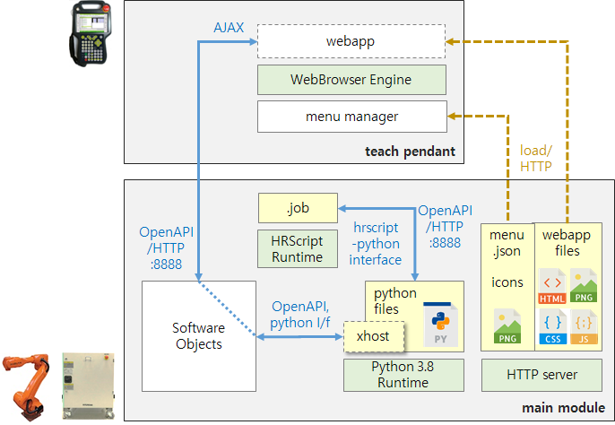

# 1.2 ${cont_model} 插件应用的概念
一个 ${cont_model} 应用由在主模块中运行的 Python 3 脚本和执行教导挂件中 UI 操作的基于 JavaScript 的 Web 软件组成。

对于没有 UI 的应用，它们可能仅由 Python 脚本组成。

多个 Python 文件和 Web 应用文件将安装在主模块中的一个文件夹下。

#### Python 脚本
这些脚本可以通过特定的机器人控制器事件或定期调用。此外，可以使用 .job 文件中的机器人语言命令调用指定的 Python 函数。

通过名为 xhost 的模块，可以控制或监视机器人控制器的软件对象，xhost 通过 Python 接口或 OpenAPI 与软件对象进行交互。

#### 教导挂件 UI Web 应用
该 Web 应用与在 PC 或移动环境中使用的普通 Web 应用相同。它由超文本标记语言 (HTML)/层叠样式表 (CSS)/JavaScript 和各种图像等资源文件组成。

该 Web 应用存储在主模块中，将转移到教导挂件上以便在 Web 浏览器引擎上执行。

通过调用 OpenAPI，教导挂件 Web 应用可以调用 Python 函数并发送和接收数据。

