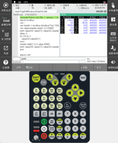

# 1.3 Installing an Hi6 virtual controller 

(temporary)
<br></br>

## 1) Installing 
Unzip the downloaded Hi6 controller zip file.

### Installing the virtual robot controller (VRC) development environment 
1. Copy and ensure that the path will be D:\util\hi6_vrc\.
   (The folder path recorded in hi6main_platform_cfg.json and hi6tp_platform_cfg.json should be modified to change the folder path.)
2. Install the Visual Studio 2013 redistributable package by executing the vcredist_x64.exe file in the install folder.
3. Copy the contents of the System32 and SysWOW64 folders from the install folder to the relevant individual folders in C:\Windows\.

### Installing the Qt library
1. Create the path C:\Qt\Qt5.7.1\5.7.
2. Unzip msvc2013 under the path.

### Installing Python 
Please refer to the contents of <u> 1.4 Installing the Python 3 development environment </u>.

<span style = 'background-color:#ffdce0'> Caution: For successful installations, you must be connected to the Internet during execution.</span>

1. Execute the "python-3.8.0.exe" file in the install folder. 
2. Tick only Add Python 3.8 to PATH, then click Customize installation.
3. Tick the checkboxes for all items afterward and start the installation.
4. End when the 'setup was successful' message is confirmed.
5. Copy the "ucrtbased.dll" and "vcruntime140d.dll" files from the install folder into C:\Program Files (x86)\Python38-32\.


## 2) Executing
1. Execute hi6_main.exe in the debug folder.
2. Run PowerShell in the debug folder, then run the teach pendant (TP) with the command as follows. 
   ```
    ./hi6_tp -layout=k
   ```

- If you execute hi6_tp right away, <U>TP600</U> will be executed.

- The <U>TP630</U> is the actual target model of Hi6 TP. Therefore, to properly execute this, you need to run TP630 by inputting '-layout=k' through commands. 

<b>TP630</b>&nbsp;  

<b>TP600</b>&nbsp;

   ### When required to interlock with HRSpace
    1. Download HRSpace from https://www.hyundai-robotics.com/customer/customer4.html?p=3 and install it.
    2. Right-click the mouse on Workspace and load the robot using "Load Model."  
    3. Right-click the mouse on Robot and select "ENetHi6" to connect the controller in "Robot Attributes."
    4. Set the IP addresses of the PC and robot controller to "127.0.0.1."
    5. Press the Start Simulation button.


<br></br>
(Content related to controller installation will be improved later along with the installer-related content)


 