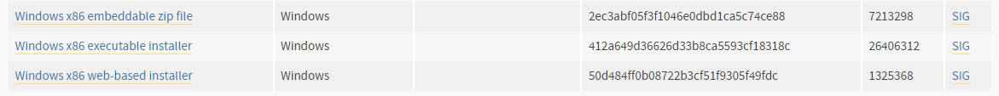
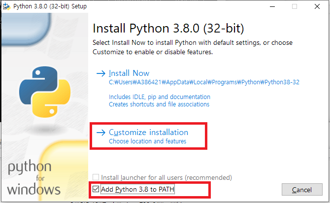
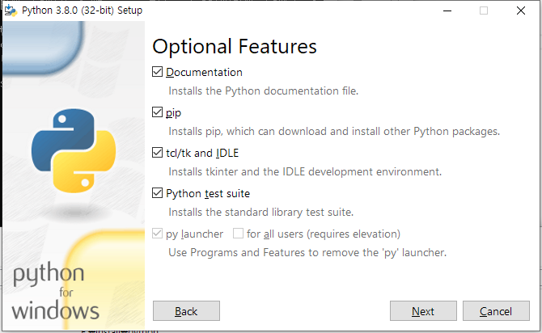
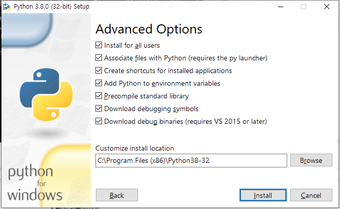
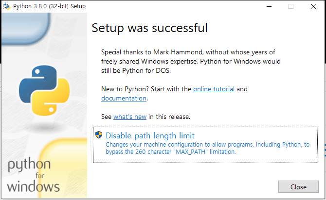

# 1.3 python3 개발환경 설치
#### python3 설치
아래의 절차에 따라 python v3.8을 설치합니다.

<br></br>
1) 아래 링크는 python v3.8.0 설치 화면으로 연결됩니다. x86 32bit를 설치하십시오.

    <span style='background-color:#ffdce0'>(주의! : ${cont_model} 가상제어기는 32bit 애플리케이션이므로 python 런타임도 이와 일치시켜야 합니다. x86-64를 설치하면 안됩니다 !) </span>

    https://www.python.org/downloads/release/python-380/

    

2) Add Python 3.8 to PATH 체크 후, Customize installation 선택합니다.  
    

3) 모두 check 하고 Next 클릭합니다.  
    
4) 모두 check. 설치 경로는 주어진 대로, C:\Program Files (x86)\Python38-32 로 두고 Install 클릭합니다.  
    
5) Disable path length limit는 안 눌러도 됩니다. Close 클릭합니다.  
    

6) 윈도우 명령 프롬프트를 엽니다. (Windows + R 누른 후 cmd 타이핑하고, enter키) 

    ```python --version``` 을 타이핑한 후 enter 키를 눌러 아래와 같은 버전이 출력되는지 확인합니다.

    ```
    Python 3.8.0
    ```
