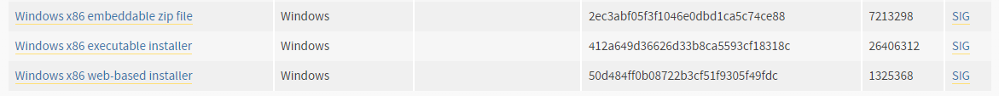
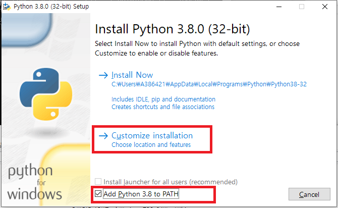
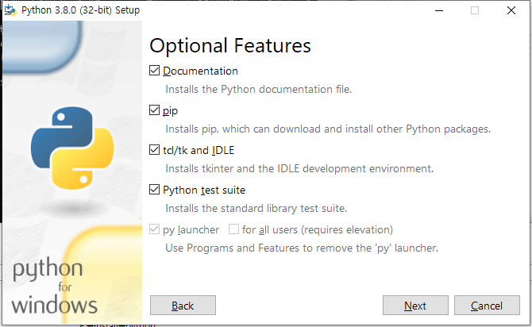
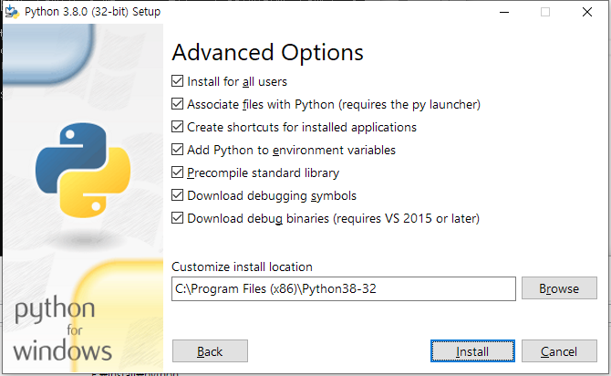
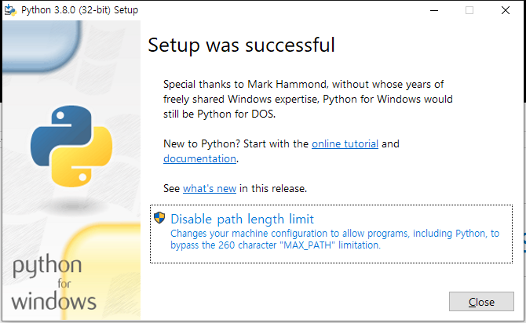

# 1.4 Installing the Python 3 development environment
## Installing Python 3 
Install Python v3.8 according to the following procedures.

<br></br>
1) The link below will lead to a Python v3.8.0. installation screen. Install x86 32bit.

    <span style='background-color:#ffdce0'>(caution: As the Hi6 virtual controller is a 32bit app, the python runtime should be made to match it. Do not install x86-64) </span>

    https://www.python.org/downloads/release/python-380/

    

2) Tick Add Python 3.8 to PATH, then select Customize installation.
    

3) Tick all and click Next.
    
4) Tick all. Leave the installation path as C:\Program Files (x86)\Python38-32 as is and click Install.
    
5) You do not need to press Disable path length limit. Click Close.
    

6) Open the Windows Command Prompt (press Windows + R, type in cmd, then press the enter key.)

    Type in ```python --version``` then press the enter key to check whether the version shown below is printed.

    ```
    Python 3.8.0
    ```

## Adding a python import search path
1) Create a .pth file and designate the path where the _common/ folder is located. 
    Open the .pth file in the SDK and designate the path below to match the HOME path of the Hi6 virtual controller.
 

    Example of file contents:    
    ```
    D:\Hi6\home_main\apps
    ```

2) Deploy the edited .pth file into the python installation path/Lib/site-packages/.
    
    Example: C:\Program Files (x86)\Python38-32\Lib\site-packages\.pth


## Deploying dynamic libraries
Deploy ucrtbased.dll and vcruntime140d.dll in the SDK to the python installation path.

Example: Copy to C:\Program Files (x86)\Python38-32\.