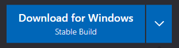
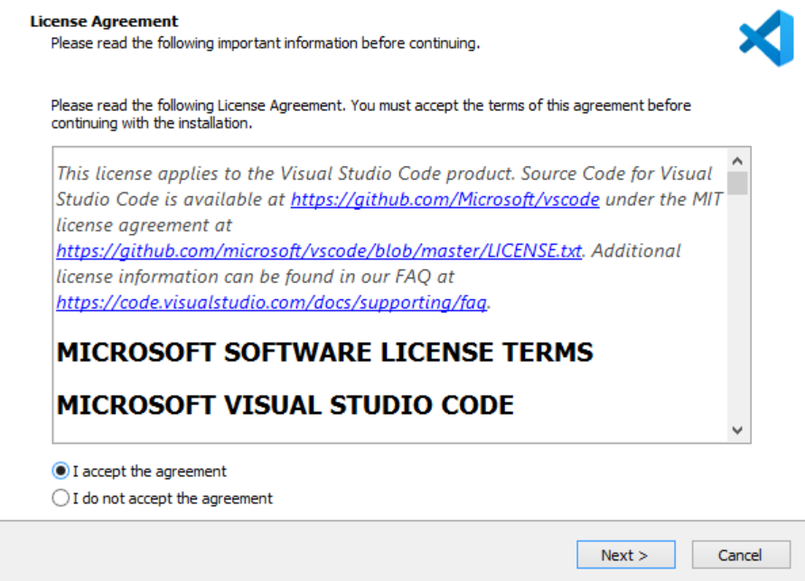
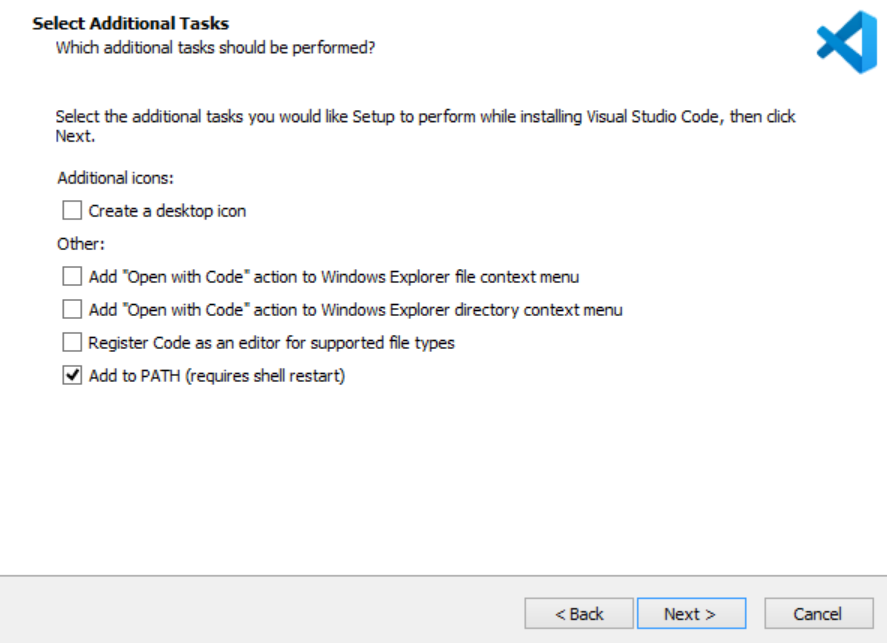
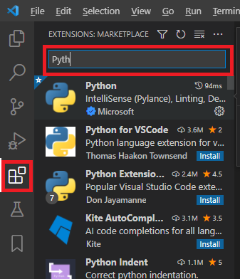
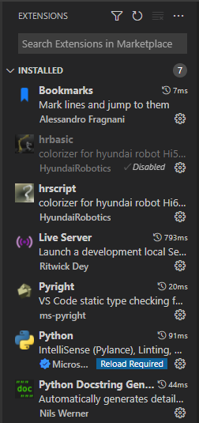
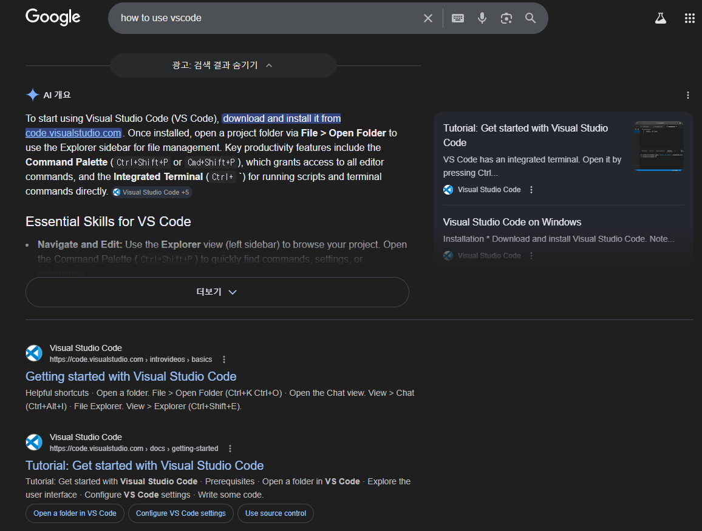

# 1.4 安装 Visual Studio Code

Microsoft Visual Studio Code（以下简称 vscode）是一个功能强大的文本编辑器，提供免费使用。通过安装各种扩展，vscode 为多种编程语言提供了开发环境。

您可以使用其他熟悉的编辑器，如 Atom 或 SublimeText，但本手册提供的说明基于 vscode。

#### 安装代码
1) 访问以下链接，然后下载适用于 Windows 的稳定版。

    对于 Windows: https://code.visualstudio.com/ 
    

2) 执行下载的安装文件并接受许可协议。

    

3) 在保留安装路径等默认值的情况下，继续按 Next 按钮。当出现选择附加任务的屏幕时，按如下所示勾选，然后单击 Next 按钮。
    
    

4) 单击 Install 按钮。

5) 安装完成后，尝试运行 vscode。

#### 安装扩展
这是 vscode 独特的优势，使得在市场上安装各种扩展成为可能。

活动栏是 vscode 屏幕最左侧的垂直栏，其中图标被排列。点击红色标记的图标将打开 EXTENSIONS: MARKETPLACE 屏幕，如图所示。当您在顶部的过滤窗口中输入所需扩展的名称时，可以轻松找到该扩展。

您需要安装的扩展如下。通过使用过滤器找到每个扩展，并使用 Install 按钮进行安装。

- 可能会有多个相同名称的扩展。通过检查作者的名称选择正确的扩展。
- 安装 Microsoft 的 Python 时，Pylance 等其他扩展将自动安装。Pylance 与我们应该使用的 Pyright 冲突。移除除 Python 之外的所有其他扩展。
- 当您编辑作业文件时，它应被识别为 HRScript，而不是 HR-BASIC。保持 HR-BASIC 禁用。

在开发过程中，除了 Python，您还将处理 html、css、javascript 和 json 扩展的文件。然而，由于这些格式的编辑功能已嵌入在 vscode 中，您无需单独安装扩展。

现在，您可以开始使用 vscode。建议通过参考 vscode 帮助菜单或在线讲座了解其使用方法。

