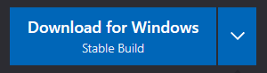
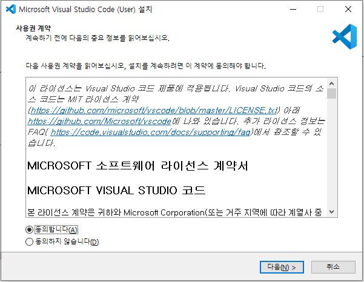
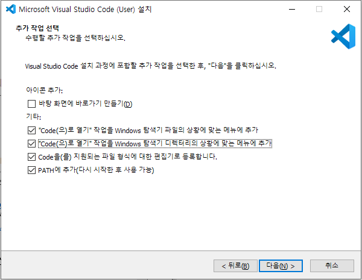
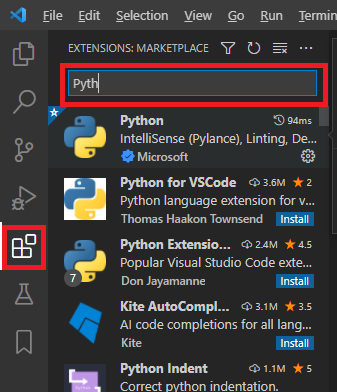
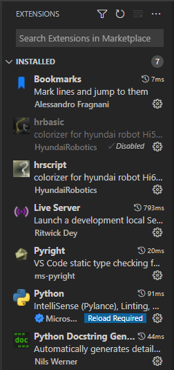
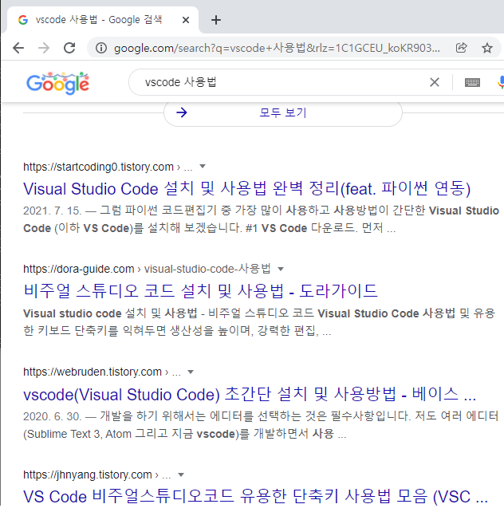

# 1.5 VisualStudio Code의 설치

Microsot Visual Studio Code (이하 vscode로 지칭)는 무료로 사용가능한 강력한 텍스트 편집기입니다. 다양한 EXTENSION 설치를 통해, 수 많은 프로그래밍 언어의 개발환경을 제공합니다.

Atom이나 SublimeText 등 본인이 익숙한 다른 편집기를 사용해도 되지만, 이 설명서에서는 vscode를 기준으로 설명하겠습니다.

Code의 설치
1) 아래 링크에 접속한 후 윈도우용 stable build 버전을 다운로드 합니다. 윈도우용  https://code.visualstudio.com/ 

2) 다운로드된 설치파일을 실행하고 라이선스에 동의합니다.

3) 설치 경로 등을 기본값 그대로 하여 <다음> 버튼을 계속 누르다가, 추가 작업 선택 화면이 나오면 아래와 같이 체크하고 <다음> 버튼을 클릭합니다. 

4) <설치> 버튼을 클릭합니다.

5) 설치가 끝나면 vscode를 실행해 봅니다.

# EXTENSION의 설치
마켓플레이스에 있는 다양한 확장(EXTENSION)을 설치할 수 있다는 것이 vscode의 강력한 장점입니다.

vscode 화면에서 가장 왼쪽에 아이콘들이 배치된 수직막대가 Activity Bar입니다. 이 중  빨간 표시된 아이콘을 누르면 그림과 같이 EXTENSIONS: MARKETPLACE가 열립니다. 상단의 필터 창에 이름을 타이핑하면 원하는 확장을 쉽게 찾을 수 있습니다.

설치해야 할 확장은 아래와 같습니다. 하나씩 필터를 통해 찾아서 Install 버튼을 클릭해 설치합니다. 

같은 이름의 확장이 여러 개 있을 수도 있습니다. 저자의 이름을 확인하여 올바른 확장을 선택하십시오.
Microsoft의 Python을 설치하면 Pylance 등 부가적인 확장들이 자동으로 추가 설치됩니다. Pylance는 우리가 사용해야 할 Pyright와 충돌합니다. Python을 제외한 부가 확장들은 모두 삭제하십시오.
job 파일 편집 시, HR-BASIC이 아닌 HRScript로 인식되어야 합니다. hrbasic은 Disabled 시켜 두십시오.

개발과정에서 python 외에 html, css, javascript, json 확장자의 파일을 다루게 되지만, 이 형식들은 편집기능이 vscode에 기본 탑재되어 있으므로 별도의 확장 설치는 필요하지 않습니다.

이제 vscode를 사용할 준비가 끝났습니다. 상세한 사용방법은 vscode의 Help 메뉴 혹은 인터넷 강좌를 참고하여 습득하시기 바랍니다.

