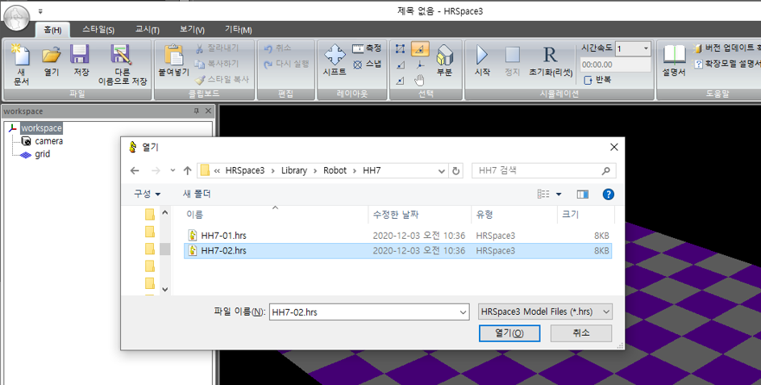
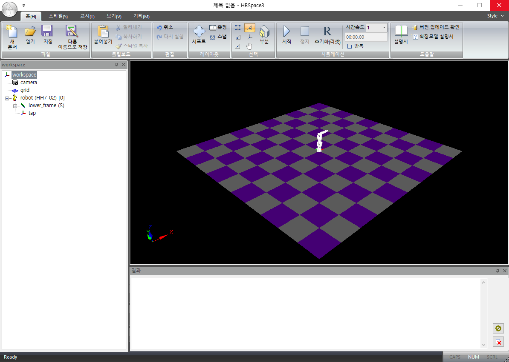
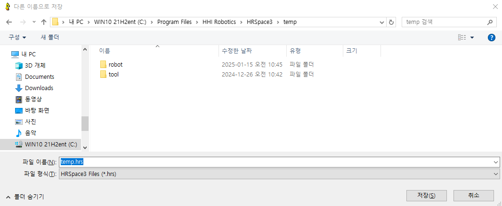
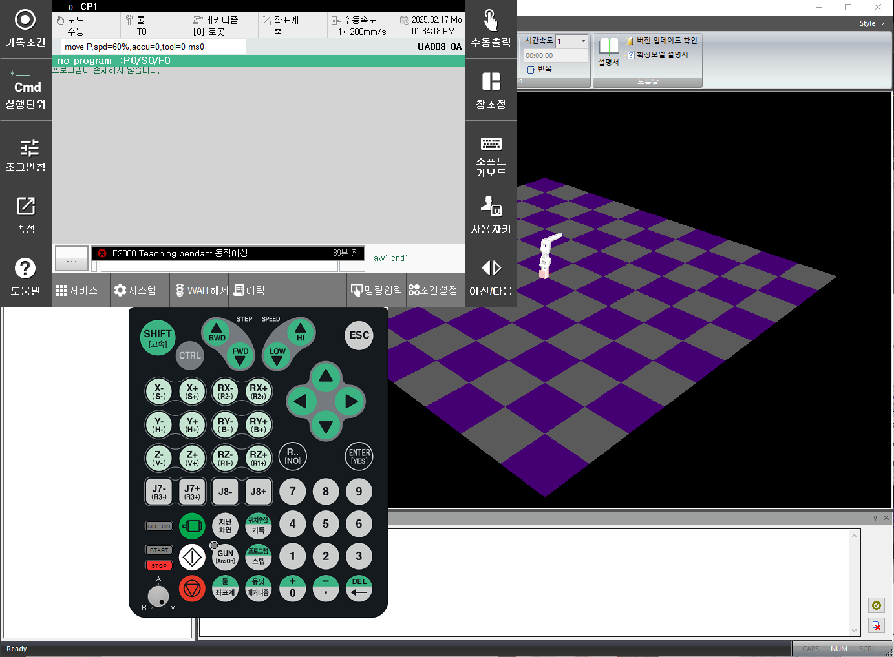

# 1.6 HRSpace 로 플러그인 테스트 하기  

본인이 작성한 플러그인 앱을 HRSpace 의 가상제어기 및 가상 티칭펜던트에서 테스트 할 수 있습니다.  

    <b>주의, 실제 제어기 환경과는 다소 차이가 있습니다.</b> 개발 단계에서 간단한 기능 테스트 확인용으로 사용하고 실기에서 충분한 테스트를 거쳐 플러그인을 사용하셔야 합니다.  

 

## 1.6.1 HRSpace 설치 환경
1) 운영 체제 : Windows 64bit

 

## 1.6.2 HRSpace 설치 과정
1) HD현대로보틱스 홈페이지에 접속 후 회원가입 미진행 시 진행
2) [HRSpace 다운로드 페이지](https://www.hd-hyundairobotics.com/biz/product/support/291) 진입
3) 최신 버전 설치 (문서 작성일 기준: v3.96b1)
4) 설치된 zip 파일 압축 해제 
5) 설치 프로그램(HRSpace3.msi) 실행 > 언어 선택 > 설치 위치 선택 > 설치 후 종료

 

## 1.6.3 HRSpace 실행하기
### a. 로봇 불러오기
1) `윈도우 키` 입력 > `HRSpace3_kor` 입력 > 클릭 > 프로그램 실행
2) 좌측 workspace 의 workspace 컴포넌트 우클릭 > ‘모델 불러오기‘ 클릭 > ‘Robot’ 클릭 > 원하는 모델 클릭  
</img>
<b>단,  C:\Program Files\HHI Robotics\HRSpace3\VRC_Hi6\fbrr 에 있는 모델만 불러와야 에러가 발생하지 않습니다.</b>
  
3) 로봇제어기(RC) 타입 > VRC_Hi6 클릭 > 확인 > 로봇 모델 로드   
</img>

### b. workspace 저장하기
1) 작업 표시줄의 `저장` 클릭&nbsp;&nbsp;</img>
2) 원하는 위치에 새로운 폴더 생성 후, 파일 저장  
   예시) 폴더 경로 중 " HRSpace3" 클릭하여 이동 > 빈공간 우클릭 > 새로만들기 > 폴더 > temp 폴더 생성 > temp.hrs 로 모델 생성 > 저장 완료되면, 제목 표시줄에 저장한 파일명이 확인됨  
   

### c. 가상 티칭펜던트 실행하기
1) 좌측 workspace 창에 생성된 robot 모델 우클릭 > 가상 티칭펜던트 클릭
   
   
 

## 1.6.4 가상 티칭펜던트에서 플러그인 실행하기