# 1.6 Testing plugins in HRSpace

You can test your own plugin app on HRSpace's virtual controller and virtual teaching pendant.

   
<b>There are differences from the actual controller environment.</b> Please use it only for simple functional tests during the development stage, and ensure thorough testing in a real environment before applying the plugin. We are not responsible for any damages or issues arising from failure to consider this information.  
  

<br>

## 1.6.1 HRSpace Installation Environment
- Operating System: Windows 64-bit

<br>

## 1.6.2 HRSpace Installation Process

1. Access the HD Hyundai Robotics website and sign up if not already registered.
2. Open the HRSpace download page.
3. Install the latest version (as of the document date: v3.95b10).
4. Extract the downloaded zip file.
5. Run the installer (HRSpace3.msi) → Select language → Choose installation location → Complete installation and exit.

<br>

## 1.6.3 Running HRSpace

### a. Load the robot model
1. Press the `Windows key` > Type `HRSpace3_eng` > Click > Run the program.
2. Right-click on the `workspace component` in the left Workspace panel > Click `Load Model as a Child...` > Click `Robot` folder > Select the desired model.  
   
   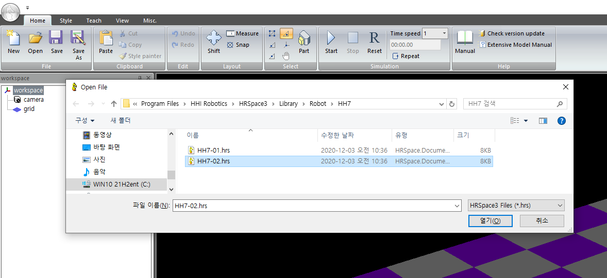


   <p style="background-color: orange; color: black;"><b>To avoid errors, only models located in ${HRSpace installation folder}\VRC_Hi6\fbrr should be loaded.</b></p>

3. Robot Controller (RC) Type Selection Popup > Click VRC_Hi6 > Confirm > Load Robot.  
   
   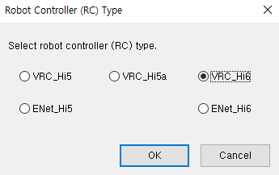

4. Robot Loaded  

   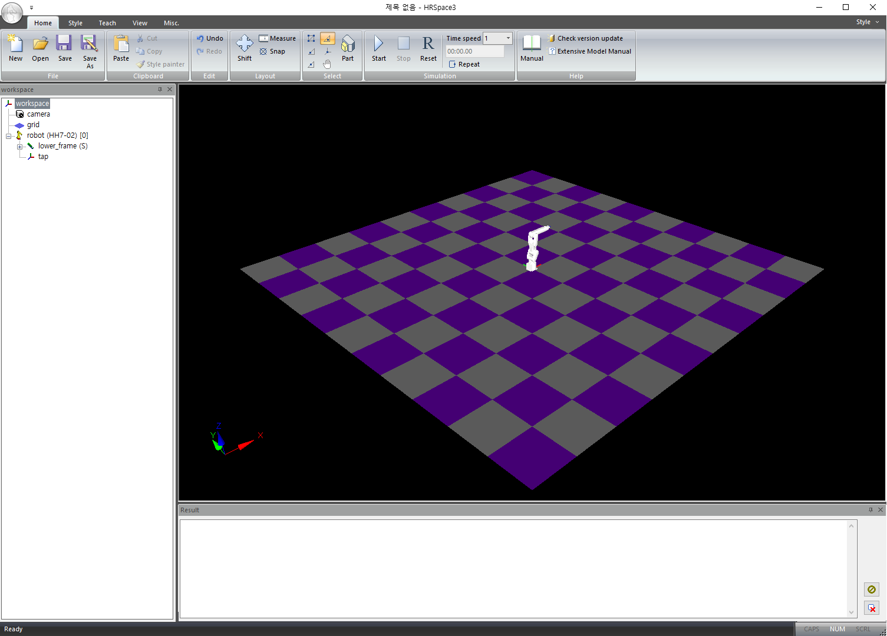


### b. Saving workspace
1. 
    Click `Save` on the taskbar. 

2. Create a new folder in the desired location and save the file.  
Example: Click on "HRSpace3" in the File Explorer address bar to navigate > Right-click on an empty space > New > Folder > Create a temp folder > Create a model as temp.hrs > Once saved, the saved filename will be displayed in the title bar. > Click `Save` on the taskbar.   
   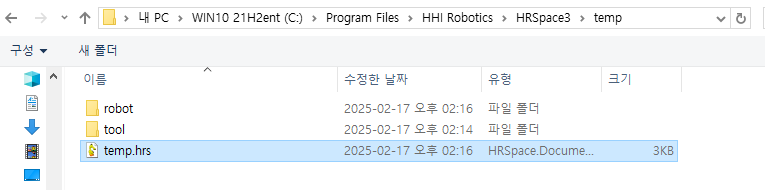  


### c. Running the Virtual Teaching Pendant

1. Right-click on the robot model created in the left workspace panel > Click Virtual Teaching Pendant.
   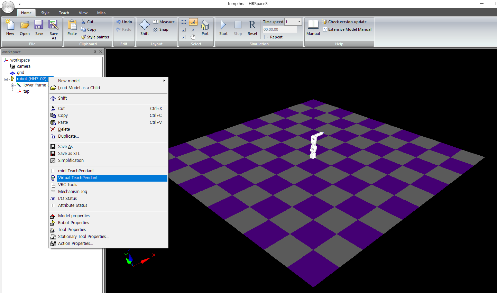

   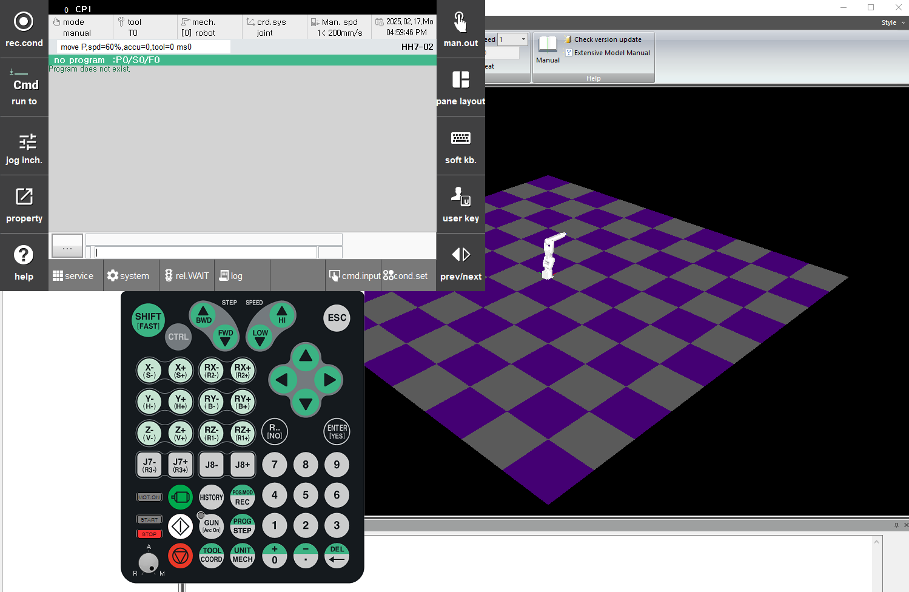

2. Two Ways to Exit the Teaching Pendant

   1. TP Home > `Service` > `9: Exit TP application`  
    
   2. Right-click on the keypad area > Click `close`

<br>

## 1.6.4 Running a Plugin on the Virtual Teaching Pendant
1. Create a hello-world example plugin and inject it into HRSpace's Virtual Teaching Pendant. This process was carried out with reference to the [HRBook manual](../2-example-helloworld/README.md).
   ```text
   hello_world
    ├── cmds.json
    ├── hello_world.py
    ├── info.json
    └── ui
        ├── lm_hello.png
        ├── menu.json
        └── setup.html
   ```

1. Save the developed hello-world plugin in the following path.
   ```text
   ${HRSpace installation folder}\VRC_Hi6\apps
   ex) C:\Program Files\HHI Robotics\HRSpace3\VRC_Hi6\apps
   ```


3. Check the location of the saved plugin.  

   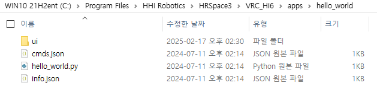


4. Exit the Virtual Teaching Pendant > Restart > TP Home > `system` > `4: Application parameter` > Check `hello, world` plugin   

   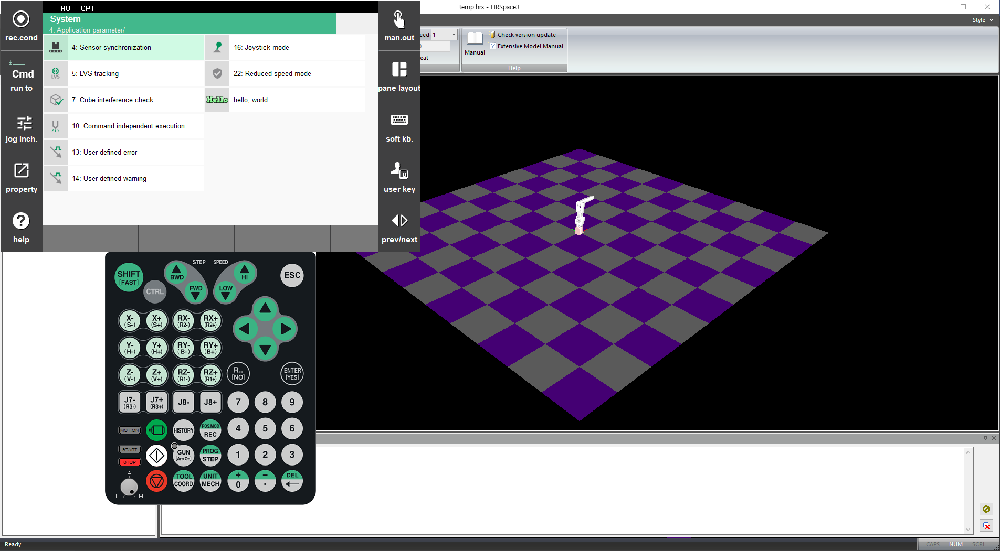  

   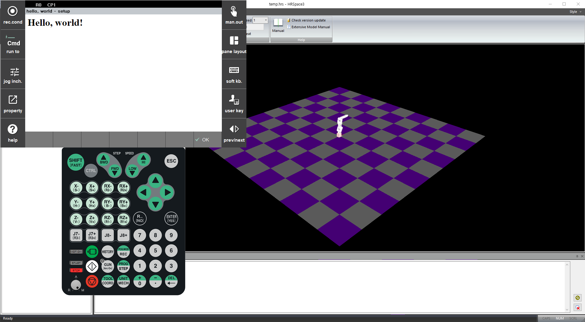

<br>

## 1.6.5 Notes
1. If you modify HTML, CSS, or JavaScript code, just return to the TP Home screen and re-enter the plugin for the changes to take effect.
2. If you modify Python code while the plugin is running, you must reboot the virtual controller for the changes to apply.  
→ Right-click on the robot in the Workspace panel > Click `VRC Tools...` > Click `Reboot`  
   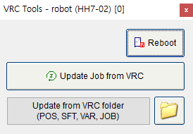
   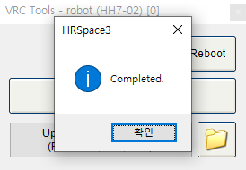  

3. After reboot the virtual controller, re-run `1.6.4 Running a Plugin on the Virtual Teaching Pendant`.