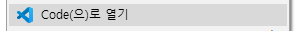
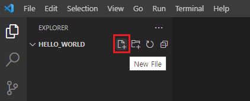
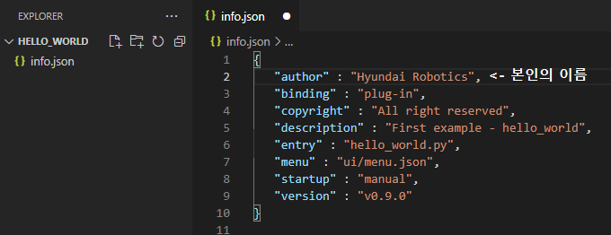

# 2.1 Creating a hello_world project – Folders and meta-information

Create a folder named hello_world under the apps/ folder. The folder name should be the project name and must be unique in the apps/ folder.

Right-click the mouse on the hello_world/ folder in the explorer and click "Open using code" in the pop-up menu.



Afterward, vscode will open with the hello_world/ folder as the project. You can create a new file in the folder by clicking New File at the top left. The file name should be info.json.



Click info.json to open it and input the following.



## info.json

``` json
{
   "author" : "Hyundai Robotics",
   "binding" : "plug-in",
   "copyright" : "All right reserved",
   "description" : "First example - hello_world",
   "entry" : "hello_world.py",
   "menu" : "ui/menu.json",
   "startup" : "manual",
   "version" : "v0.9.0"
}
```

</br>
<table>
  <thead>
    <tr>
      <th style="text-align:left">Key</th>
      <th style="text-align:left">Meaning</th>
    </tr>
  </thead>
  <tbody>
    <tr>
      <td>author</td>
      <td>
       Author
      </td>
    </tr>
   <tr>
      <td>binding</td>
      <td>
       The form of binding with the Hi6 host software</br>
       - Plug-in: Will be executed in bound form.</br>
       - Standalone: Will be executed as an independent app (process.) 
      </td>
    </tr>
    <tr>
      <td>copyright</td>
      <td>
       Copyright
      </td>
    </tr>
    <tr>
      <td>description</td>
      <td>
       Description	
      </td>
    </tr>
    <tr>
      <td>entry</td>
      <td>
       The name of the file at the execution start location</br>
       The name should be unique in the apps/ folder. If possible, set it as one of the following names below</br>
       - {project name}.py</br>
       - {project name}_main.py
      </td>
    </tr>
    <tr>
      <td>menu</td>
      <td>
       Menu structure of the user interface	
      </td>
    </tr>
     <tr>
      <td>startup</td>
      <td>
       Execution start mode
       - Manual: Manually start the execution
       - Boot: Automatically start the execution while booting	
      </td>
    </tr>
     <tr>
      <td>version</td>
      <td>
       Version string	
      </td>
    </tr>
  </tbody>
</table>