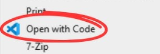
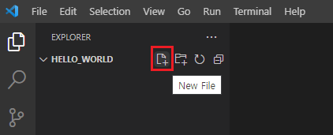
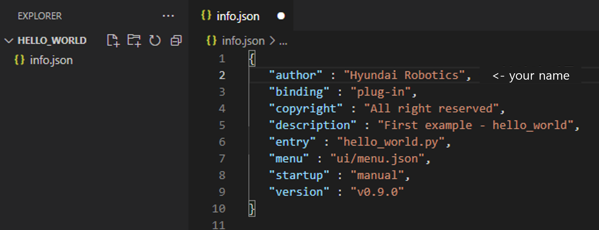

# 2.1 创建 hello_world 项目 - 文件夹和元信息

在 apps/ 文件夹下创建一个名为 hello_world 的文件夹。文件夹名称应为项目名称，并且在 apps/ 文件夹中必须是唯一的。

在资源管理器中右键点击 hello_world/ 文件夹，然后在弹出菜单中点击“使用代码打开”。



之后，vscode 将以 hello_world/ 文件夹作为项目打开。您可以通过点击左上角的“新建文件”来在文件夹中创建新文件。文件名应为 info.json。



点击 info.json 打开它并输入以下内容。



#### info.json

``` json
{
   "author" : "HD Hyundai Robotics",
   "binding" : "plug-in",
   "copyright" : "All right reserved",
   "description" : "第一个示例 - hello_world",
   "entry" : "hello_world.py",
   "menu" : "ui/menu.json",
   "startup" : "manual",
   "version" : "v0.9.0"
}
```

<br>
<table>
  <thead>
    <tr>
      <th style="text-align:left">键</th>
      <th style="text-align:left">含义</th>
    </tr>
  </thead>
  <tbody>
    <tr>
      <td>`作者 (author)`</td>
      <td>
       作者
      </td>
    </tr>
   <tr>
      <td>`binding`</td>
      <td>
       与 ${cont_model} 主机软件的绑定形式<br>
<<<SOURCE_MARKDOWN_START>>>       - 插件：将以绑定形式执行。<br>
       - 独立应用：将作为独立应用（进程）执行。 
      </td>
    </tr>
    <tr>
      <td>`copyright`</td>
      <td>
       版权
      </td>
    </tr>
    <tr>
      <td>`描述 (description)`</td>
      <td>
       描述	
      </td>
    </tr>
    <tr>
      <td>`entry`</td>
      <td>
       执行启动位置的文件名<br>
       该名称在 apps/ 文件夹中应是唯一的。如果可能，请将其设置为以下名称之一<br>
       - {project name}.py<br>
       - {project name}_main.py
      </td>
    </tr>
    <tr>
      <td>`菜单 (menu)`</td>
      <td>
       用户界面的菜单结构	
      </td>
    </tr>
     <tr>
      <td>`启动 (startup)`</td>
      <td>
       执行启动模式
       - 手动：手动启动执行
       - 启动：在引导时自动启动执行	
      </td>
    </tr>
     <tr>
      <td>`version`</td>
      <td>
       版本字符串	
      </td>
    </tr>
  </tbody>
</table>
<<<SOURCE_MARKDOWN_END>>>