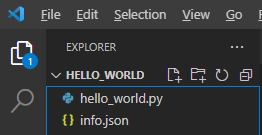
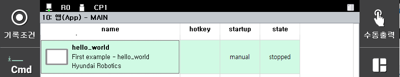

# 2.2 python 함수 hello( ) 구현

New File 버튼으로 새로운 파일을 만들고 이름을 hello_world.py로 정합니다.


hello_world.py는 아래와 같이 작성합니다.

```python
import xhost
 
def hello():
    print("Hello, world!")
    xhost.printh("Hello, world!")
```

- python 프로그래밍을 익혔다면 이미 알고 있겠지만, def 아래 행들은 tab 문자로 들여쓰기 해야 합니다.
- xhost는 호스트(로봇제어기)의 기능을 호출하기 위한 모듈입니다. xhost.py라는 파일은 직접 작성할 필요가 없습니다. 후속 절에서 자세히 설명되므로 여기서는 이 정도만 이해하면 됩니다.

이제 Hi6 가상제어기 main과 TP를 차례로 실행합니다.

Hi6 제어기 main은 시작하면서 apps/ 폴더 밑의 모든 폴더의 info.json를 읽어들임으로써, 설치된 app들을 인식합니다.

[서비스] - 10: 앱(App)을 클릭하면 10: 앱(App) - TP라는 제목의 화면이 나타납니다. [location] 버튼을 2번 클릭하면 제목의 TP가 USB를 거쳐 MAIN으로 바뀝니다. 이 화면에서 우리가 만든 hello_world를 찾을 수 있습니다.



우리는 hello_world를 로봇언어에서 실행할 것이므로, ESC 키를 눌러 화면에서 빠져나갑니다.

이제 HRScript로 job 프로그램을 하나 생성합니다. 아래와 같이 교시하십시오.

```
import hello_world
hello_world.hello()
end
```

지난화면 pane을 열어놓고 모터ON을 하고, Step FWD 혹은 START 버튼으로 실행하면, 지난화면 창에 Hello, World! 가 출력됩니다.

```
15:05:20.894 ( 968) .import hello_world

15:05:20.894 ( 0)_____[STOP for CmdMode]

15:05:25.413 (4518890)_____[START:StepFwd]__(P2/S0./F1)___

15:05:25.415 Hello, world!

15:05:25.416 ( 2968) .var ret=hello_world.hello()

15:05:25.417 ( 1024)_____[STOP for CmdMode]

15:05:32.157 (6740100)_____[START:StepFwd]__(P2/S0./F2)___

15:05:32.158 ( 970) .end
```

<span style='background-color:#ffdce0'>
주의: python 프로그램을 수정하면 가상제어기 main을 다시 실행해야 수정한 내용이 반영됩니다. 
</span>