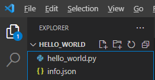
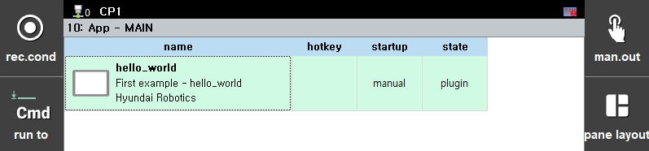

# 2.2 实现 python 函数 hello( )

使用“新建文件”按钮创建一个新文件，并将其命名为 hello_world.py。


您可以像下面这样编写 hello_world.py。

```python
import xhost
 
def hello():
    print("Hello, world!")
    xhost.printh("Hello, world!")
```

- 如果您熟悉 python 编程，您可能知道 def 下面的一行应该用制表符缩进。
- xhost 是一个调用主机（机器人控制器）功能的模块。您不必自己编写 xhost.py 文件。后面的章节将提供详细的解释，所以现在这就是您需要了解的内容。
<br></br>

现在，按顺序执行 ${cont_model} 虚拟控制器和 TP。

启动时，${cont_model} 控制器通过读取 apps/ 文件夹下所有文件夹中的 info.json 来识别已安装的应用程序。

[service] - 10: 点击该应用程序会弹出一个名为 10: app - TP 的屏幕。

双击 `[location]` 按钮将通过 USB 将标题中的 TP 更改为 MAIN。在这个屏幕上，可以找到之前创建的 hello_world。



我们将在机器人语言中执行 hello_world，因此按 ESC 键退出该屏幕。

现在，使用 HRScript 创建一个作业程序。按照如下方式进行教学过程。

```
import hello_world
hello_world.hello()
end
```

在保留之前的屏幕窗格打开并开启电机的情况下，如果您执行 Step FWD 或 START 按钮，将会打印 Hello, World!。

```
15:05:20.894 ( 968) .import hello_world

15:05:20.894 ( 0)_____[STOP for CmdMode]

15:05:25.413 (4518890)_____[START:StepFwd]__(P2/S0./F1)___

15:05:25.415 Hello, world!

15:05:25.416 ( 2968) .var ret=hello_world.hello()

15:05:25.417 ( 1024)_____[STOP for CmdMode]

15:05:32.157 (6740100)_____[START:StepFwd]__(P2/S0./F2)___

15:05:32.158 ( 970) .end
```
<span style='background-color:#ffdce0'>
注意：如果您修改了 Python 程序，则应运行虚拟控制器以反映该修改。
</span>