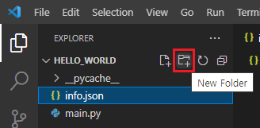
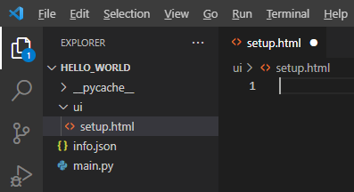
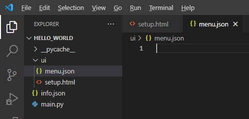
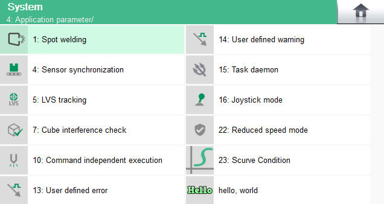
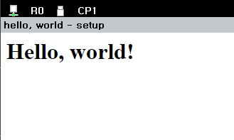

# 2.4 创建简单的基于网络的用户界面

可以添加基于网络的用户界面，以便使用教学挂件设置应用程序。

在这个例子中，我们将创建一个简单的功能，在教学挂件屏幕上打印你好，世界！。


通过点击左上角的“新建文件夹”按钮来创建一个新文件夹。将文件夹名称设置为ui。



在ui/文件夹中创建一个新文件，并将其命名为setup.html。结果将在下图中显示。



将以下代码写入setup.html。
```
<!DOCTYPE html:5>
<html>
 
<head>
    <title>hello, world - setup</title>
    <meta http-equiv=Content-Type content='text/html; charset=utf-8'>
</head>
 
<body>
   <div>
      <div id='contents'>
         <h1>Hello, world!</h1>
      </div>
   </div>
</body>
</html>
```

现在，在教学挂件的系统 - 应用参数菜单下，注入设计用于打开此屏幕的菜单项。

在ui/文件夹下创建一个menu.json文件。


``` json
[
    {
        "path": "system/appl/",
        "id": "hello_world",
        "icon": "hello_world/ui/lm_hello.png",
        "label": "hello, world",
        "url": "hello_world/ui/setup.html"
    }
]
```
每个项目的含义如下。
<table>
  <thead>
    <tr>
      <th style="text-align:left">键</th>
      <th style="text-align:left">含义</th>
    </tr>
  </thead>
  <tbody>
    <tr>
      <td>path</td>
      <td>
       用于注入菜单项的菜单路径<br>(system/appl/ 表示 "system/4: 应用程序参数。")
      </td>
    </tr>
   <tr>
      <td>id</td>
      <td>
       菜单项的 ID 
      </td>
    </tr>
    <tr>
      <td>icon</td>
      <td>
       要在菜单屏幕上显示的项图标的相对路径名称和文件名称（基于 apps/ 文件夹）
      </td>
    </tr>
    <tr>
      <td>label</td>
      <td>
       要在菜单屏幕上显示的项名称
      </td>
    </tr>
    <tr>
      <td>url</td>
      <td>选择菜单项时要显示的 html 屏幕的相对路径名称和文件名称（基于 apps/ 文件夹）</td>
    </tr>
  </tbody>
</table>

即使未指定图标，其操作也将继续进行。但是，我们将创建一个图标并进行实践。

图标的格式应为包含透明信息的 png 文件，即 104x104 像素。

 lm_hello.png 的示例（您可以下载并使用此图片。）

<br>
在 Windows 中使用 Paint 创建带有透明背景的 png 文件是不可能的。我们推荐以下软件。
为了您的信息，我们仅用一分钟就通过COOLTEXT创建了示例中的图片。

Adobe Illustrator (https://www.adobe.com/kr/products/illustrator.html): 插图软件（商业）

GIMP (http://gimp.org): 类似Photoshop的图像编辑软件（免费）

Medibang Paint Pro (https://medibangpaint.com/pc/):
易于使用的图形工具（免费）

COOLTEXT (https://cooltext.com/): 创建文本转图标图像文件的网站（免费）


再次执行虚拟主板和虚拟教学挂件。


进入[系统] - [应用程序参数]菜单时，可以看到新添加的hello, world菜单项，如下所示。


当您按下菜单时，教学挂件将显示setup.html屏幕，如下所示。

（最初，加载大约需要一到两秒。在后续情况下，缓存将加载得更快。）

