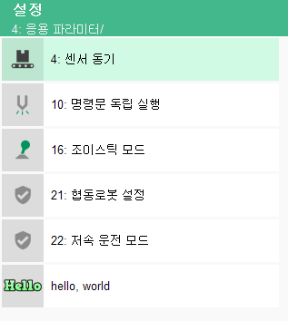

# 2.4 간단한 웹 기반 U/I 화면 만들기

app에 대한 설정을 티치펜던트로 하기 위해, 웹 기반의 U/I를 추가할 수 있습니다.

본 예제에서는 티치펜던트 화면에 Hello, world!를 출력하는 간단한 기능을 만들어 보겠습니다.


좌상단의 New Folder 버튼을 클릭하여 새 폴더를 만듭니다. 폴더명은 ui로 설정합니다.


ui/ 폴더에 새 파일을 만든 후, 이름은 setup.html로 설정합니다. 이제 아래 그림과 같은 상황이 됩니다.


setup.html에 아래 코드를 작성합니다.
```
<!DOCTYPE html:5>
<html>
 
<head>
    <title>hello, world - setup</title>
    <meta http-equiv=Content-Type content='text/html; charset=utf-8'>
</head>
 
<body>
   <div>
      <div id='contents'>
         <h1>Hello, world!</h1>
      </div>
   </div>
</body>
</html>
```

이제, 이 화면을 열기 위한 메뉴항목을 티치펜던트의 시스템 - 응용파라미터 메뉴 밑에 주입해 봅시다.

ui/ 폴더 밑에 menu.json 파일을 생성합니다.


``` json
[
    {
        "path": "system/appl/",
        "id": "hello_world",
        "icon": "hello_world/ui/lm_hello.png",
        "label": "hello, world",
        "url": "hello_world/ui/setup.html"
    }
]
```

각 항목의 의미는 아래와 같습니다.
<table>
  <thead>
    <tr>
      <th style="text-align:left">key</th>
      <th style="text-align:left">의미</th>
    </tr>
  </thead>
  <tbody>
    <tr>
      <td>path</td>
      <td>
       메뉴 항목을 주입할 메뉴 경로</br>(system/appl/는 시스템/4: 응용 파라미터"를 의미합니다.
      </td>
    </tr>
   <tr>
      <td>id</td>
      <td>
       메뉴 항목의 id 
      </td>
    </tr>
    <tr>
      <td>icon</td>
      <td>
       메뉴 화면에 표시할 항목 icon의 (apps/ 폴더 기준의) 상대경로파일명
      </td>
    </tr>
    <tr>
      <td>label</td>
      <td>
       메뉴 화면에 표시할 항목 이름
      </td>
    </tr>
    <tr>
      <td>url</td>
      <td>메뉴 항목 선택 시, 표시할 html 화면의 (apps/ 폴더 기준의) 상대경로파일명</td>
    </tr>
  </tbody>
</table>

icon 지정은 안하더라도 동작은 합니다. 하지만 icon까지 한번 만들어서 실습해봅시다.

icon의 형식은 104x104 pixel의 투명성(transparency) 정보를 포함한 png 파일이어야 합니다.

 lm_hello.png의 예 (이 그림을 다운받아 사용해도 됩니다.)

</br>
윈도우OS의 그림판(Paint)으로는 투명 배경의 png 파일을 만들 수 없습니다. 아래 몇 가지 소프트웨어들을 추천합니다.

참고로, 예제의 그림은 COOLTEXT로 1분만에 생성했습니다.

Adobe Illustrator (https://www.adobe.com/kr/products/illustrator.html) : 일러스트 소프트웨어. (상용)

GIMP (http://gimp.org) : 포토샵 수준의 이미지 편집 소프트웨어. (무료)

Medibang Paint Pro (https://medibangpaint.com/pc/) : 쉬운 사용법의 그래픽 툴. (무료)

COOLTEXT (https://cooltext.com/) : text를 로고 그림파일로 생성해주는 웹 사이트. (무료)


이제 가상 메인보드과 가상 티치펜던트를 재실행 합니다.


시스템 - 응용 파라미터 메뉴로 진입하면 아래와 같이 새로 추가된 hello, world 메뉴 항목이 보입니다.


메뉴를 누르면 아래와 같이 setup.html 의 화면이 티치펜던트에 나타납니다.

(처음에는 1~2초 정도의 로딩 시간이 소요될 수 있습니다. 2번째 부터는 캐시에 의해 좀 더 빠르게 로딩됩니다.)


