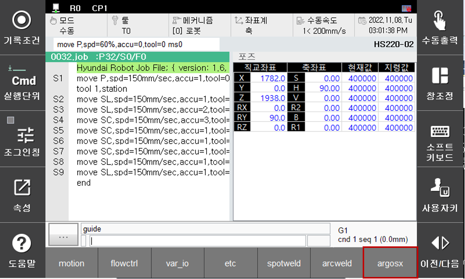
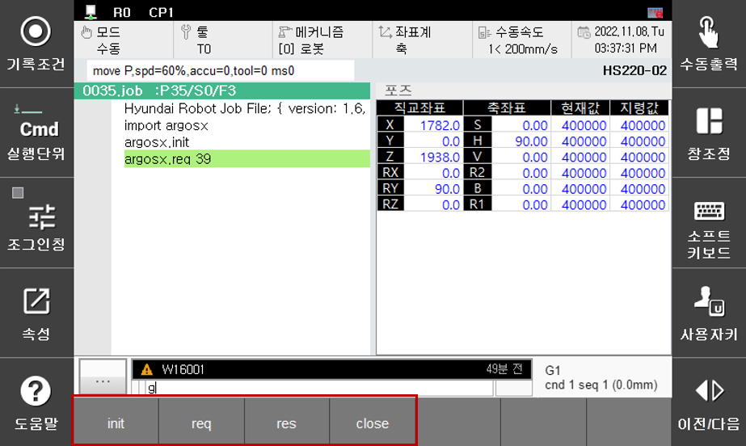

# 3.1.10 Registering the robot language command inputs

Inputting a robot language directly when using a teach pendant is inconvenient.

Therefore, we need to ensure that a robot language can be written more easily through [Command Inputting].

For this purpose, we need to register a robot language.

First, we need to add a "cmds" label to info.json. For a value corresponding to it, we need to designate a json that contains the organized content of cmds.

info.json
```json
{
	"author" : "BlueOcean Robot & Automation, Ltd.",
	"binding" : "plug-in",
	"cmds" : "cmds.json",
	"copyright" : "All right reserved",
	"description" : "ArgosX Vision System interface",
	"entry" : "main.py",
	"menu" : "ui/menu.json",
	"startup" : "boot",
	"version" : "v0.9.0"
}
```

Add cmds.json into the ArgosX folder to define the properties of the commands in the relevant files.

``` json
{
	"fmts" : [
		{
			"name": "init"
		},
		{
			"name": "req",
			"samples": "req 39",
			"props": [
				{
					"guide": "work no.",
					"range": "[1~100]"
				}
			]
		},
		{
			"name": "res"
		},
		{
			"name": "close"
		}
	]
}

```

|Item|Meaning|Example|
|---|---|---|
|fmts|Robot language module name|"fmts"|
|name|Function name|"name": "init"|
|samples|Sample (robot language input type))|"samples": "req 39"|
|props|Function's input properties|"props"|
|guide|Input argument guide message|"guide": "work no."|
|range|Input argument value's range|"range": "[1–100]"|

The meaning of each item is as follows in the table above. If there are many input arguments, arrange the properties into as many groups as the number of input arguments, then add them into "props".


<br></br>
For an added command, you can check it by pressing the [Command Inputting] button at the bottom of the teach pendant.


[Command Inputting]-[argosx]
