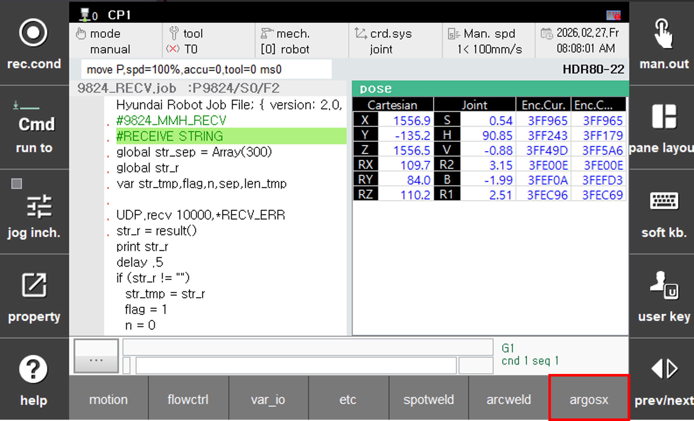
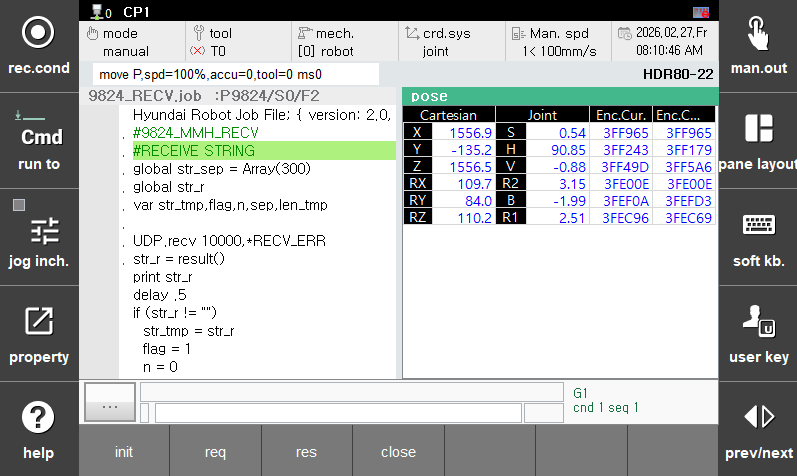

#### 3.1.10 注册机器人语言命令输入

在使用教导操作面板时直接输入机器人语言不方便。

因此，我们需要确保机器人语言可以通过[命令输入]更轻松地编写。

为此，我们需要注册机器人语言。

首先，我们需要在info.json中添加一个“cmds”标签。对应的值需要指定一个包含cmds组织内容的json。

info.json
```json
{
	"author" : "BlueOcean Robot & Automation, Ltd.",
	"binding" : "plug-in",
	"cmds" : "cmds.json",
	"copyright" : "All right reserved",
	"description" : "ArgosX Vision System interface",
	"entry" : "main.py",
	"menu" : "ui/menu.json",
	"startup" : "boot",
	"version" : "v0.9.0"
}
```

将cmds.json添加到ArgosX文件夹中，以定义相关文件中命令的属性。

``` json
{
	"fmts" : [
		{
			"name": "init"
		},
		{
			"name": "req",
			"samples": "req 39",
			"props": [
				{
					"guide": "工作编号",
					"range": "[1~100]"
				}
			]
		},
		{
			"name": "res"
		},
		{
			"name": "close"
		}
	]
}

```

|Item|Meaning|Example|
|---|---|---|
|fmts|机器人语言模块名称|"fmts"|
|name|功能名称|"name": "init"|
|samples|示例（机器人语言输入类型）|"samples": "req 39"|
|props|功能的输入属性|"props"|
|guide|输入参数指导消息|"guide": "工作编号"|
|range|输入参数值的范围|"range": "[1-100]"|

每个项目的含义见上表。如果有多个输入参数，将属性分组为与输入参数数量相同的组，然后添加到“props”中。

<br></br>
对于添加的命令，可以通过按教导操作面板底部的[命令输入]按钮进行检查。


[命令输入]-[argosx]  
