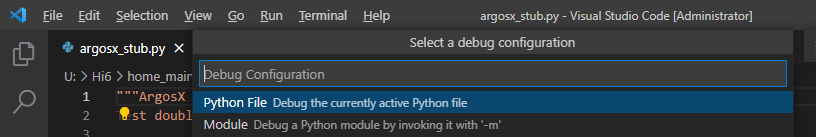
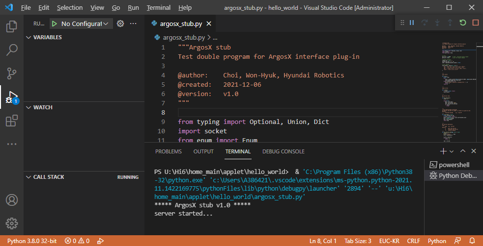

# 3.1.2 ArgosX stub

ArgosX 비전 시스템은 실제로 존재하는 장치가 아닙니다. 따라서 우리가 인터페이스 플러그인을 시험하려면, ArgosX의 역할을 대신해줄 시험용 소프트웨어, 즉 stub가 필요합니다.

아래 python code는 ArgosX stub입니다. 구현 내용을 이해할 필요는 없습니다.

argosx_stub.py
``` python
"""ArgosX stub
Test double for ArgosX interface plug-in
 
 
@author:    Jane Doe, BlueOcean Robot & Automation, Ltd.
@created:   2021-12-06
@version:   v1.0
"""
 
import time
from typing import Optional, Union, Dict
import socket
 
 
# const
buf_size = 0x8000    # 32kb ; permitted packet length
port_no = 54321      # port for ArgosX command
sleep_sec = 0        # delay before response
 
# global variables
inaddr_any : str = ""
ip_port_of_req = ("", 0)
sock : Optional[socket.socket] = None
 
# test samples
test_shifts : Dict[str, str]= {
   "5" : "(30, 25.7, 11.9, 31.6, 12.8, -54.6)",
   "39" : "(9, 15.5, 10.3, 11.2, 19.2, 1.3)",
   "98" : "fail",
   "else" : "(0, 0, 0, 0, 0, 0)"
}
 
 
# functions
def init():
   """
   init server
   """
   global sock
   try:
      sock = socket.socket(family=socket.AF_INET, type=socket.SOCK_DGRAM)
      sock.bind((inaddr_any, port_no))
   except socket.error as e:
      print("socket creation or binding error :", e)
      return -1
   return 0
 
 
def close():
   """
   close server
   """
   if sock is None: return
   sock.close()
 
 
def do_service():
   """
   do service loop
   """
   state = 0
    
   while(True):
      msg = recv_msg()
      msg = msg.strip('\x00')
      ret = do_service_sub(msg)
      if ret==1:
         break
 
 
def recv_msg() -> str:
   """
   receive UDP message (blocking)
   IP address and port of sender is stored in ip_port_of_req
   Returns:
         received message     e.g. "req 39"
   """
   global ip_port_of_req
   if sock is None: return ""
   data, ip_port_of_req = sock.recvfrom(buf_size)
   bts = bytearray(data)
   msg = bts.decode()
   return msg
 
 
def do_service_sub(msg: str) -> int:
   """
   do service subroutine
   Args:
         msg   e.g. "req 39"
   Returns:
         1     quit the service
         0     continue the service
         -1    invalid command  
   """
   print('')
   print('request : ', msg)
   strs = msg.split()
       
   n_str = len(strs)
   if n_str < 1:
      return -1
    
   cmd = strs[0]
   param = ""
   if n_str >= 2:
      param = strs[1]
    
   if cmd=="req":
      time.sleep(sleep_sec)
      do_service_req(param)
   elif cmd=="light-on":
      print('LED light is ON')
   elif cmd=="light-off":
      print('LED light is OFF')
   elif cmd=="quit":
      return 1
   else:
      print('invalid command')
      return -1
   return 0
 
 
def do_service_req(param: str) -> int:
   """
   do service for req
   Args:
      param    work#    "1"~"100"
 
   Returns:
         -1    no socket
         >=0   the number of bytes sent
   """
   if sock is None: return -1
   res_value = ""
   try:
      res_value = test_shifts[param]
   except:
      res_value = test_shifts["else"]
   msg = "res " + res_value
   print('response: ', msg)
   bts = bytearray(str.encode(msg))
   return sock.sendto(bts, ip_port_of_req)
    
 
# -----------------------------------------------
# main
print('***** ArgosX stub v1.0 *****')
iret = init()
if iret < 0:
   quit()
print('inaddr_any, port_no=%d' % port_no)
print('server started...')
do_service()
print('closing...')
close()
print('...server ended')
```

위 내용을 복사하여 hello_world/ 폴더 아래에 argosx_stub.py 파일을 생성해놓고, 윈도우 PowerShell이나 명령 프롬프트에서  hello_world/ 폴더로 이동한 후 아래 명령으로 실행하십시오.
```
python argosx_stub.py
```

혹은,  vscode에 열어 놓고, F5키를 누르면 디버그 모드로 실행됩니다.

- argosx/ 프로젝트를 열어 둔 vscode에서 열지 말고, vscode를 하나 더 실행하여 여십시오.
- 처음에는 아래와 같이 debug configuration 리스트가 열릴 수도 있는데, Python File 항목을 선택하면 됩니다.



출력은 하단의 TERMINAL 창으로 나옵니다. 우상단의  버튼을 조작해 디버깅을 일시정지, 재실행, 정지할 수 있습니다.

