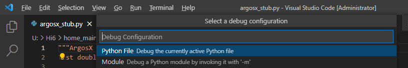
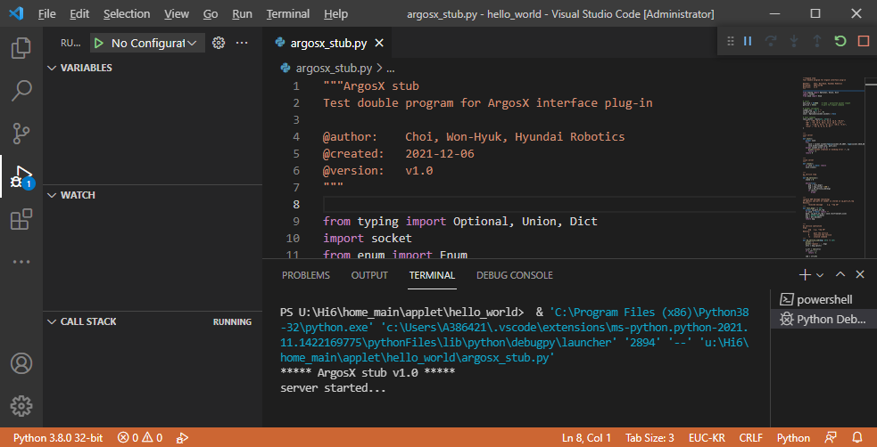

#### 3.1.2 ArgosX stub

ArgosX 视觉系统并不真实。因此，如果我们想要测试接口插件，我们需要测试软件，也就是 stub，来代替 ArgosX。

下面的 Python 代码是 ArgosX stub。您无需理解其实现的细节。

argosx_stub.py
``` python
"""ArgosX stub
ArgosX 接口插件的测试替代品
 
 
@author:    Jane Doe, BlueOcean Robot & Automation, Ltd.
@created:   2021-12-06
@version:   v1.0
"""
 
import time
from typing import Optional, Union, Dict
import socket
 
 
# const
buf_size = 0x8000    # 32kb ; 允许的包长度
port_no = 54321      # ArgosX 命令的端口
sleep_sec = 0        # 响应前的延迟
 
# global variables
inaddr_any : str = ""
ip_port_of_req = ("", 0)
sock : Optional[socket.socket] = None
 
# test samples
test_shifts : Dict[str, str]= {
   "5" : "(30, 25.7, 11.9, 31.6, 12.8, -54.6)",
   "39" : "(9, 15.5, 10.3, 11.2, 19.2, 1.3)",
   "98" : "fail",
   "else" : "(0, 0, 0, 0, 0, 0)"
}
 
 
# functions
def init():
   """
   初始化服务器
   """
   global sock
   try:
      sock = socket.socket(family=socket.AF_INET, type=socket.SOCK_DGRAM)
      sock.bind((inaddr_any, port_no))
   except socket.error as e:
      print("套接字创建或绑定错误 :", e)
      return -1
   return 0
 
 
def close():
   """
   关闭服务器
   """
   if sock is None: return
   sock.close()
 
 
def do_service():
   """
   执行服务循环
   """
   state = 0
    
   while(True):
      msg = recv_msg()
      msg = msg.strip('\x00')
      ret = do_service_sub(msg)
      if ret==1:
         break
 
 
def recv_msg() -> str:
   """
   接收 UDP 消息 (阻塞)
   发送者的 IP 地址和端口存储在 ip_port_of_req
   Returns:
         接收到的消息     例如 "req 39"
   """
   global ip_port_of_req
   if sock is None: return ""
   data, ip_port_of_req = sock.recvfrom(buf_size)
   bts = bytearray(data)
   msg = bts.decode()
   return msg
 
 
def do_service_sub(msg: str) -> int:
   """
   执行服务子程序
   Args:
         msg   例如 "req 39"
   Returns:
         1     退出服务
         0     继续服务
         -1    无效命令  
   """
   print('')
   print('请求 : ', msg)
   strs = msg.split()
       
   n_str = len(strs)
   if n_str < 1:
      return -1
    
   cmd = strs[0]
   param = ""
   if n_str >= 2:
      param = strs[1]
    
   if cmd=="req":
      time.sleep(sleep_sec)
      do_service_req(param)
   elif cmd=="light-on":
      print('LED 灯已开启')
   elif cmd=="light-off":
      print('LED 灯已关闭')
   elif cmd=="quit":
      return 1
   else:
      print('无效命令')
      return -1
   return 0
 
 
def do_service_req(param: str) -> int:
   """
   执行 req 服务
   Args:
      param    work#    "1"~"100"
 
   Returns:
         -1    无套接字
         >=0   发送的字节数
   """
   if sock is None: return -1
   res_value = ""
   try:
      res_value = test_shifts[param]
   except:
      res_value = test_shifts["else"]
   msg = "res " + res_value
   print('响应: ', msg)
   bts = bytearray(str.encode(msg))
   return sock.sendto(bts, ip_port_of_req)
    
 
# -----------------------------------------------
# main
print('***** ArgosX stub v1.0 *****')
iret = init()
if iret < 0:
   quit()
print('inaddr_any, port_no=%d' % port_no)
print('服务器已启动...')
do_service()
print('关闭中...')
close()
print('...服务器已结束')
```

复制上述内容，并在 hello_world/ 文件夹中创建一个 argosx_stub.py 文件。接下来，使用 Windows PowerShell 或命令提示符进入 hello_world/ 文件夹，然后使用以下命令执行它。

```
python argosx_stub.py
```

或者，如果您打开 vscode 并按 F5，执行将在调试模式下进行。

- 而不是在打开的 vscode 中打开 argosx/ 项目，您需要通过执行另一个 vscode 会话来打开该项目。
- 虽然调试配置列表可能会先打开，如下所示，您只需选择 Python File 项目。



结果将在底部的 TERMINAL 窗口中打印。您可以通过操作右上角的  按钮来暂停、恢复或停止调试。

