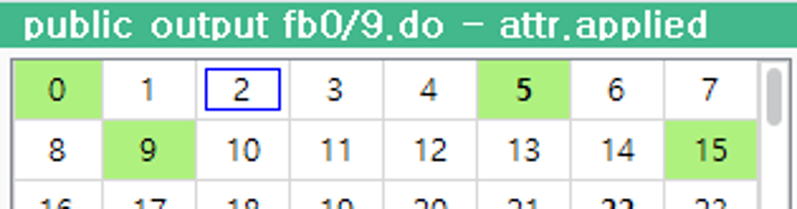

#### 3.1.7 调用 xhost 模块方法

xhost 是一个包含各种方法的模块，用于调用主机（机器人控制器）的功能。

主要模块虚拟控制器将创建 xhost 并将其注入到 Python 运行时中。您可以通过导入 xhost 来使用它，无需自己编写 xhost.py 文件。


请参阅 <U>3.1.8 手动，参考 xhost 模块的方法</U>。


在 <U>3.1.1 ArgosX 规格和接口插件的说明</U> 中还有一个关于错误处理的项目。

- 当从 ArgosX 收到“fail”时，相应于预设号的机器人控制器的通用 I/O 输出信号将被打开。


机器人控制器的通用 I/O 输出信号可以使用以下方法开/关。
``` python 
def io_set_out_bit(sigcode: int, val: int) -> int
```

sigcode 是一个将块号和 I/O 索引合并为一个数字的代码，如下所示。

sigcode = 块号 x 10000 + 索引
<br></br>

例如，fb3.do72 的 sigcode 如下所示。

3 x 10000 + 72 = 30072
<br></br>


如果 val 为 1 则为开启，0 则为关闭。
<br></br>

将分配给 ArgosX 错误的输出信号编号作为名为 sigcode_err 的模块变量添加，并将其默认值设置为 5（即 fb0.do5）。

（我们也可以将其声明为属性，以便在 HRScript 中进行修改。但在此示例中将跳过。）

setup.py
```python 
..previous steps skipped
ip_addr : str = "192.168.1.100"
port : int = 54321
sigcode_err = 5
```

在 res( ) 函数中接收到的 msg 值将与“res fail”进行比较，并根据结果传输输出信号。
<br></br>


roblang.py
```python
.. previous steps skipped
  
  
import xhost
  
  
...skipped
 
 
def res() -> str:
   """
   等待来自 ArgosX 的响应
   返回：
      来自 ArgosX 的响应字符串
      "" 如果失败。
      例如"[30, 25.7, 11.9, 31.6, 12.8, -54.6]"
   """
   val = 0
   msg = comm.recv_msg()
   print(msg)
   if msg=="res fail":
      val = 1
      msg = ""
   else:
      msg = get_base_shift_array_from_res(msg)
   xhost.io_set_out_bit(setup.sigcode_err, val)
   return msg
```

执行虚拟控制器时，同时保持教学挂件的通用输出面板打开，执行工作程序。

因为没有失败，操作将与之前相同，fb0.do5 打印信号将不会被打开。

argosx_stub.py 设计为在请求工作 #98 时无条件响应失败。修改工作以便能够执行 req(98)，如下所示，然后再次进行实现。


job
```
...Previous steps skipped
 
 
     iret=argosx.req(98) # 发送请求
     if iret<0
       print "req error"
       stop
     endif
      
     var str=argosx.res() # 等待响应
     print str
     if str==""
       print "req error"
       stop
     else
       var sft=Shift(str) # 将移位数组字符串转换为移位数据
       print sft.x, sft.y, sft.z, sft.rx, sft.ry, sft.rz
     endif
 
     argosx.close() # 关闭套接字
     end
```

如果在执行 res( ) 时 fb0.do5 打印信号被打开，则表示错误信号已正常打印。


信号 #5 应仅用于 ArgosX 错误。因此，不能用于其他需要将其作为分配信号的应用程序。


使用以下 xhost 方法，您可以指定特定的 sigcode 作为分配。
```python 
def io_assign_set_out_bit(sigcode: int) -> int
```

当您在 main.py 中定义 on_app_init( ) 函数时，输入一个例程以指定分配，如下所示，执行将在导入 ArgosX 的那一刻发生。


main.py
```python 
.. previous steps skipped
 
 
import xhost
 
 
...skipped
 
 
def on_app_init() -> int:
   """（回调）在自我诊断后立即调用
   返回：
      0
   """
   print('[argosx] on_app_init();')
   xhost.io_assign_set_out_bit(setup.sigcode_err)
   return 0
```

再次执行虚拟控制器。在作业中执行 import argosx 时，重新打开通用输出面板。

指定的信号将显示为已分配（粗体）。

