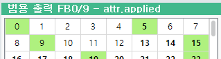

# 3.1.7 Calling the xhost module methods

xhost is a module containing various methods to call the functions of the host (robot controller).

The virtual controller, which is the main module, will create xhost and inject it into the Python runtime. You can use xhost by importing it, and there is no need to write a xhost.py file for yourself.


Refer to <U>3.1.8 Manual for referring to the methods of the xhost module</U>.


There is also an item regarding error handling in <U>3.1.1 Specifications of ArgosX and interface plug-ins</U>.

- When "fail" is received from ArgosX, the universal I/O output signal of the robot controller corresponding to the preset number will be switched on.


The universal I/O output signals of the robot controller can be switched on/off using the method below.
``` python 
def io_set_out_bit(sigcode: int, val: int) -> int
```

sigcode is a code that combines the block number and index of the I/O into one number, as shown below.

sigcode = block number x 10000 + index
<br></br>

For example, the sigcode of fb3.do72 is as follows.

3 x 10000 + 72 = 30072
<br></br>


1 if val is on and 0 if it is off.
<br></br>

Add the output signal-assigned number for the ArgosX error as a module variable named sigcode_err, and set its default value to 5 (i.e. fb0.do5.)

(We can also declare it as an attribute to make a change possible in HRScript. However, it will be skipped in this example.)


setup.py
```python 
..previous steps skipped
ip_addr : str = "192.168.1.100"
port : int = 54321
sigcode_err = 5
```

 The msg value received in the res( ) function will be compared with "res fail", and an output signal will be transmitted according to the result.
<br></br>


roblang.py
```python
.. previous steps skipped
  
  
import xhost
  
  
...skipped
 
 
def res() -> str:
   """
   wait response from ArgosX
   Returns:
      response string from ArgosX
      "" if failed.
      e.g. "[30, 25.7, 11.9, 31.6, 12.8, -54.6]"
   """
   val = 0
   msg = comm.recv_msg()
   print(msg)
   if msg=="res fail":
      val = 1
      msg = ""
   else:
      msg = get_base_shift_array_from_res(msg)
   xhost.io_set_out_bit(setup.sigcode_err, val)
   return msg
```

Execute the virtual controller, and, while leaving the universal output panel of the teach pendant open, execute the job program.

Because there is no failure, the operation will be the same as before, and the fb0.do5 print signal will not be switched on.

argosx_stub.py is designed to unconditionally respond with failures when work #98 is requested. Modify the job so that req(98) can be performed, as shown below, then perform the implementation again.


job
```
...Previous steps skipped
 
 
     iret=argosx.req(98) # transmitting the request
     if iret<0
       print "req error"
       stop
     endif
      
     var str=argosx.res() # waiting for a response
     print str
     if str==""
       print "req error"
       stop
     else
       var sft=Shift(str) # converting the shift array string into shift data
       print sft.x, sft.y, sft.z, sft.rx, sft.ry, sft.rz
     endif
 
     argosx.close() # closing the socket
     end
```

If the fb0.do5 print signal is switched on when res( ) is executed, it means the error signal has been printed normally.


Signal #5 should be used only for ArgosX errors. Therefore, it cannot be used for other applications that require it to be an assigned signal.


Using the xhost method below, you can designate a specific sigcode as assigned.
```python 
def io_assign_set_out_bit(sigcode: int) -> int
```

When you define an on_app_init( ) function in the main.py, then input a routine that designates an assignment, as shown below, the execution will occur at the moment ArgosX is imported.


main.py
```python 
.. previous steps skippd
 
 
import xhost
 
 
...skipped
 
 
def on_app_init() -> int:
   """(callback) called just after self-diagnosis
   Returns:
      0
   """
   print('[argosx] on_app_init();')
   xhost.io_assign_set_out_bit(setup.sigcode_err)
   return 0
```

Execute the virtual controller again. Then, when import argosx is executed in the job, reopen the universal output panel.

The designated signal will be displayed as assigned (bold).

