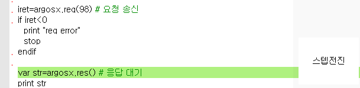
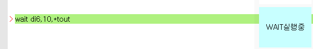
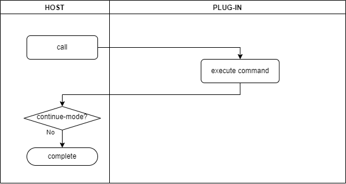
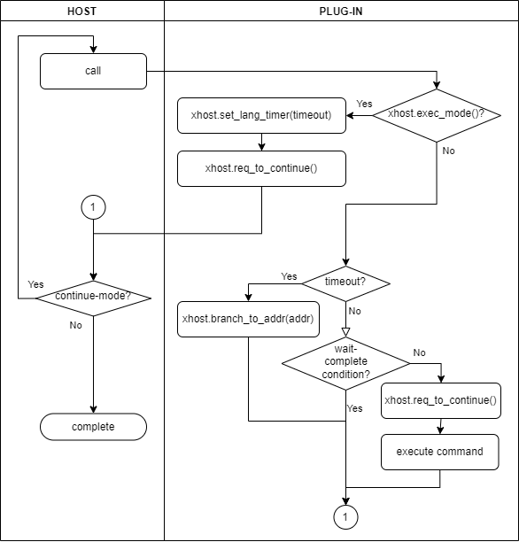
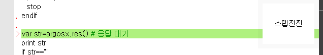

# 3.1.9 Solving the robot language function-blocking problem
## Blocking problem


There is one problem with the recv_msg( ) function implemented in the previous section.

When this function is called, there will be a waiting period for a remote response, and only when the response is received will the operation of the function end. If there is no response because of a problem with the ArgosX system, which is supposed to respond, waiting will continue permanently without the function ending.


Let's check how the job program operates in a situation where there is no response from argosx_sub.py.

For the purposes of testing, find a variable called sleep_sec in argosx_stub.py and change its value to 20. Then, when receiving a "req ~" request, argosx_stub will wait 20 seconds before responding with a "res ~" response.

 

argosx_stub.py
``` python 
# const
buf_size = 0x8000    # 32kb ; permitted packet length
port_no = 54321      # port for ArgosX command
sleep_sec = 20        # delay before response
```


Let's execute argosx_stub.py again, then run the job program line by line with the teach pendant's STEP FWD key.

If you execute argosx.res( ) right after executing argosx.req, it will be impossible to move the cursor for 20 seconds after the req is executed, as you can see below. This state is called blocking, and it is not good in terms of user operability. This specification is problematic because it can cause a situation where you have to turn the robot controller off and on if there is no response permanently.
<br></br>


Which specification would be desirable? In general, when a command is waiting for a certain state, such as the wait command, waiting will occur when the STEP FWD key is pressed, and the cursor can be moved when the key is not pressed. In addition, timeout and the escape address can be designated as arguments, so when a timeout occurs, the exception-handling operation to branch to the escape address can be performed.
<br></br>


If a timeout occurs after 10 seconds in the wait-di6 state, branching to *tout will occur.  


## Execution mode and continue mode


Let’s take a look at the flow chart below. There are two modes where the Hi6 host calls the robot language commands: execution mode and continue mode. In continue mode, the host calls the command again.

The host calls commands in execution mode first. In most cases, individual commands perform their operations and end immediately, while the host completes the handling of the commands after confirming that it is not in continue mode.
<br></br>




However, some commands have a wait operation (meaning it waits for a certain state or event, such as I/O input, Ethernet data reception, certain periods of time, robot operation completion, etc.) The following procedure will be performed between the host and a plug-in. 

* The plug-in’s wait operation command will check the mode with xhost.exec_mode( ). True means execution mode and false means continue mode. As such, if the mode is confirmed to be execution mode (Yes), the time, transferred to the timeout argument, will be set to the timer for the robot language (set_lang_timer), and the Hi6 host will be requested to call in continue mode next time before the operation ends.
* If the operation ends after the execution of xhost.req_to_continue, it means the mode is continue mode. Accordingly, the Hi6 host calls the relevant command again.
* The plug-in’s wait operation command will check the mode with xhost.exec_mode( ). If the mode is confirmed to be continue mode (No), the timer will be checked. If a timeout has occurred, branching to the escape address (branch_to_addr) will occur, and the operation will end without making a request for continue mode.
* If a timeout has not occurred, whether the wait condition is complete (wait-complete condition?) will be checked. If the wait condition is complete, the operation will end as is because there is no request for continue mode, but if it is not complete, the operation will end without the Hi6 host being requested to call in continue mode (req_to_continue.)
* If there is no request for continue mode in the current call (continue-mode No), the Hi6 host will complete the handling of the relevant command.
<br></br>

 


Now let's improve argosx.res( ) in a way that it can also have the specifications for the wait operation.


## Making a non-blocking comm module


For the comm module implemented for Ethernet transmissions/receptions, a socket module is used internally. A socket is in blocking mode by default, meaning that the socket.recvfrom( ) function, a UDP reception function, does not perform any return operations until data is received.

First, we need to change the socket instance, which we used, to non-blocking mode. Insert sock.setblocking(False) into the comm.open( ) function, as shown below.


comm.py
``` python
def open(ip_addr: str, port: int) -> int:
   """
   open socket for UDP communication
   Args:
      ip_addr     ip adddress of remote. e.g. "192.168.1.172"
      port        port# of remote. e.g. "192.168.1.172"
 
 
   Returns:
         0     ok
         -1    error
   """
   global raddr, sock
   try:
      raddr = (ip_addr, port)
      sock = socket.socket(family=socket.AF_INET, type=socket.SOCK_DGRAM)
      sock.setblocking(False)
   except socket.error as e:
      print("socket creation or binding error :", e)
      return -1
   logd('comm.open: ' + str(raddr))
   return 0
```

Now, for the socket.recvfrom( ) function, if there is no data received, a BlockingIOError exception will occur immediately without blocking taking place (if data is received, the return operation will occur immediately).

Insert the handling for returning with an empty string upon the occurrence of the BlockingIOError exception into the comm.recv_msg( ).


comm.py
``` python
def recv_msg():
   """
   wait msg from sock
   Returns:
      received string
   """
   if sock is None: return ""
 
 
   try:
      data, ip_port = sock.recvfrom(buf_size)
      bts = bytearray(data)
      msg = bts.decode()
      logd('response: ' + msg)
      return msg
   except BlockingIOError:
      return ""
   except Exception as e:
      print('exception from recv_msg(): ' + str(e))
      return ""

```


## Implementing a wait operation in the res( ) function


Add two arguments, timeout and addr_on_timeout (escape address), into the res( ) function as follows.

If a timeout is not designated, the default value, -1, will be applied, causing infinite waiting period to occur. If the escape address is not designated, the default value, -1, will be applied, causing the process to go to the next command without branching occurring upon timeout.

Remove the existing implementation. After that, implement a wait operation in a simple form where the mode will be checked with the xhost.exec_mode( ) function. If the mode is execution mode, the res_exec( ) will be called, but if it is in continue mode, the res_cont( ) function will be called.


roblang.py
``` python 
""" ArgosX Vision System interface - robot language
 
 
@author:    Jane Doe, BlueOcean Robot & Automation, Ltd.
@created:   2021-12-06
"""
 
from . import comm
from . import setup
 
import xhost
import typing
 
 
# type
int_or_str = typing.Union[int, str]
 
 
 
Skipped...
 
 
 
def res(timeout: int=-1, addr_on_timeout: int_or_str=-1) -> str:
   """
   wait response from ArgosX
    
   Args:
      timeout: (ms), Default(-1) means infinite.
      addr_on_timeout: branch address on timeout.
         (e.g. 99, "S7", "*TimeOut")
         Default(-1) means no branch.
 
 
   Returns:
      response string from ArgosX.
      "" if failed.
      e.g. "[30, 25.7, 11.9, 31.6, 12.8, -54.6]"
   """
   ret = ""
   if xhost.exec_mode():
      _res_exec(timeout)
   else:
      ret = _res_cont(addr_on_timeout)
   return ret
```


Now, let’s implement the _res_exec( ) right below the res( ) function. For this implementation, the timer for the robot language will be set to the timeout argument value, and the host will be requested to call in continue mode before the operation ends. Isn’t it simple?


roblang.py
``` python
Previous steps skipped...
 
 
def _res_exec(timeout: int) -> None:
   """res() implementation for exec-mode"""
   xhost.set_lang_timer(timeout)
   xhost.req_to_continue()
```

The actual operation will be performed in the _res_cont( ) function for continue mode. The branching upon timeout operation is created as the check_timeout_and_branch( ) function.

If a timeout occurs, the sigcode_err output signal will be turned on, and the operation will end immediately.

If a timeout does not occur, data reception will be performed. If there was no data received while this process occurred, the host will be requested to call in continue mode (xhost.req_to_continue). After that, the operation of returning with an empty string will be performed.


roblang.py
``` python
Previous steps skipped...
 
 
def _res_cont(addr_on_timeout: int_or_str) -> str:
   """res() implementation for cont-mode"""
   val = 0
   msg = ""
   timeout = _check_timeout_and_branch(addr_on_timeout)
   if timeout:
      val = 1
   else:
      msg = comm.recv_msg()
      print(msg)
      if msg=="res fail":
         val = 1
         msg = ""
      elif msg=="":    # No response
         xhost.req_to_continue()
      else:    # Normal response
         msg = get_base_shift_array_from_res(msg)
   xhost.io_set_out_bit(setup.sigcode_err, val)
   return msg
 
 
 
def _check_timeout_and_branch(addr_on_timeout: int_or_str) -> bool:
   """if timeout, do branch.
 
   Returns:
      True     timeout. branched.
      False    not-timeout.
   """
   timer = xhost.lang_timer()
   if timer!=0: return False  # not-timeout
   # timeout!
   if addr_on_timeout==-1:
      return True
   # make as str, unconditionally
   str_addr = str(addr_on_timeout)
   xhost.branch_to_addr(str_addr)
   return True
```


## Testing the non-blocking operation  


Now let's check if the specifications were made as we desired. Execute the virtual controller again and run the job program line by line with the teach pendant's STEP FWD key.

If you execute argosx.req, then execute argosx.res( ) immediately after, the operation will not complete because the response did not come in yet. When you release the STEP FWD key, the step forward indicator will be turned off, allowing you to move the cursor. If you press the STEP FWD key, the waiting state will resume.

If 20 seconds pass after the execution of req( ) while the STEP FWD key is pressed, reception will be completed.
</br>



Now, let's add a timeout argument. Designate it as 3000 ms and execute the operation again. If 3 seconds pass while the STEP FWK key is pressed, it will move to the next command.

job
```
var str=argosx.res(3000) # waiting for a response
 
print str
```

Now, let's add an escape step as well. When you teach it as follows and press the STEP FWD key for more than 3 seconds on the res( ) function, you can see that branching to line number 99 occurs and "timeout" will be executed.


job
```
... Previous steps skipped
      
     var str=argosx.res(3000,99) #waiting for a response
     print str
     if str==""
       print "req error"
       stop
     else
       var sft=Shift(str) # converting the shift array string into shift data
       print sft.x, sft.y, sft.z, sft.rx, sft.ry, sft.rz
     endif
      
     argosx.close()
     end
      
  99 print "timeout"
     end
```

