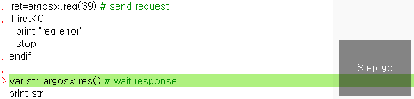
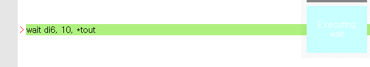
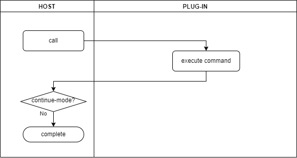
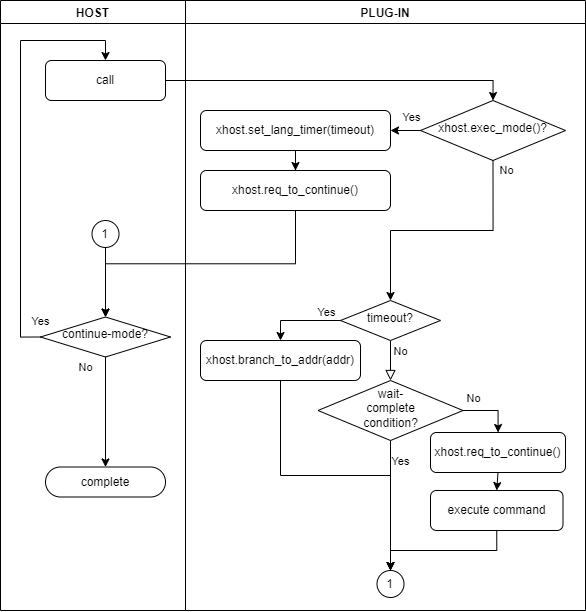
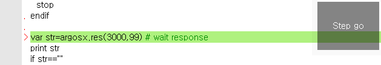

#### 3.1.9 解决机器人语言功能阻塞问题
##### 阻塞问题

在上一个章节中实现的 recv_msg( ) 函数存在一个问题。

当调用此函数时，会有一个等待远程响应的时间，只有在收到响应后，该函数的操作才会结束。如果由于 ArgosX 系统的问题没有响应，等待将会永久持续而无法结束该函数。

让我们检查在没有来自 argosx_sub.py 的响应的情况下，作业程序是如何工作的。

为了进行测试，找到 argosx_stub.py 中名为 sleep_sec 的变量，并将其值更改为 20。然后，在接收到 "req ~" 请求时，argosx_stub 将在响应 "res ~" 之前等待 20 秒。

argosx_stub.py
``` python 
# const
buf_size = 0x8000    # 32kb ; 允许的数据包长度
port_no = 54321      # ArgosX 命令的端口
sleep_sec = 20        # 响应前的延迟
```

让我们再次执行 argosx_stub.py，然后使用教学挂件的 STEP FWD 键逐行运行作业程序。

如果在执行 argosx.req 之后立即执行 argosx.res( )，则在执行 req 后 cursor 将在 20 秒内无法移动，如下所示。此状态称为阻塞，从用户操作性上来说并不好。这个规范是有问题的，因为如果没有响应，可能会导致必须关闭和重新启动机器人控制器的情况。
<br></br>


哪个规范更为理想？一般来说，当命令在等待某种状态时，例如 wait 命令，当按下 STEP FWD 键时，会发生等待，而当未按下按键时，光标可以移动。此外，超时和逃逸地址可以指定为参数，因此在发生超时时，可以执行异常处理操作来分支到逃逸地址。
<br></br>


如果在 wait-di6 状态下 10 秒后发生超时，则将分支到 *tout。

#### 执行模式与继续模式

让我们来看下面的流程图。${cont_model} 主机调用机器人语言命令的模式有两种：执行模式和继续模式。在继续模式中，主机再次调用命令。

主机首先在执行模式中调用命令。在大多数情况下，各个命令执行它们的操作并立即结束，而主机在确认不处于继续模式后完成对命令的处理。
<br></br>



然而，一些命令具有等待操作（意味着它等待某种状态或事件，例如 I/O 输入、以太网数据接收、特定的时间段、机器人操作完成等）。主机与插件之间将执行以下过程。

* 插件的等待操作命令将通过 xhost.exec_mode( ) 检查模式。True 表示执行模式，False 表示继续模式。因此，如果确认该模式为执行模式（是），则时间将转移到超时参数，并且将请求 ${cont_model} 主机下次以继续模式调用，直到操作结束。
* 如果在执行 xhost.req_to_continue 后操作结束，则意味着该模式为继续模式。因此，${cont_model} 主机再次调用相关命令。
* 插件的等待操作命令将通过 xhost.exec_mode( ) 检查模式。如果确认该模式为继续模式（否），则将检查定时器。如果发生超时，将分支到逃逸地址（branch_to_addr），并在没有继续模式请求的情况下结束操作。
* 如果未发生超时，则会检查等待条件是否完成（wait-complete condition？）。如果等待条件完成，由于没有继续模式请求，操作将如常结束；但如果未完成，操作将在未请求 ${cont_model} 主机继续模式（req_to_continue）调用的情况下结束。
* 如果当前调用中没有继续模式请求（继续模式否），则 ${cont_model} 主机将完成对相关命令的处理。
<br></br>

 

现在让我们改进 argosx.res( ) 使其也具备等待操作的规范。

##### 制作非阻塞通讯模块

为进行以太网传输/接收实现的通讯模块，内部使用了 socket 模块。默认情况下，socket 是阻塞模式，这意味着 socket.recvfrom( ) 函数，即 UDP 接收函数，在数据接收之前不会执行任何返回操作。

首先，我们需要将使用的 socket 实例更改为非阻塞模式。在 comm.open( ) 函数中插入 sock.setblocking(False)，如下面所示。

comm.py
``` python
def open(ip_addr: str, port: int) -> int:
   """
   打开用于 UDP 通信的 socket
   参数：
      ip_addr     远程的 ip 地址。例如 "192.168.1.172"
      port        远程的端口号。例如 "192.168.1.172"
 
   返回：
         0     正常
         -1    错误
   """
   global raddr, sock
   try:
      raddr = (ip_addr, port)
      sock = socket.socket(family=socket.AF_INET, type=socket.SOCK_DGRAM)
      sock.setblocking(False)
   except socket.error as e:
      print("socket 创建或绑定错误 :", e)
      return -1
   logd('comm.open: ' + str(raddr))
   return 0
```

现在，对于 socket.recvfrom( ) 函数，如果没有收到数据，将立即发生 BlockingIOError 异常，而不会发生阻塞（如果收到数据，将立即进行返回操作）。

在 comm.recv_msg( ) 中插入处理，用于在发生 BlockingIOError 异常时返回空字符串。

comm.py
``` python
def recv_msg():
   """
   等待来自 sock 的消息
   返回：
      接收到的字符串
   """
   if sock is None: return ""
 
   try:
      data, ip_port = sock.recvfrom(buf_size)
      bts = bytearray(data)
      msg = bts.decode()
      logd('响应: ' + msg)
      return msg
   except BlockingIOError:
      return ""
   except Exception as e:
      print('recv_msg() 中发生异常: ' + str(e))
      return ""
```

##### 在 res( ) 函数中实现等待操作

向 res( ) 函数添加两个参数，timeout 和 addr_on_timeout（逃逸地址），如下所示。

如果未指定超时，则将应用默认值 -1，导致无限等待。如果未指定逃逸地址，则将应用默认值 -1，导致在超时时不会发生分支。

删除现有实现。之后，在简单形式中实现等待操作，其中使用 xhost.exec_mode( ) 函数检查模式。如果模式为执行模式，将调用 res_exec( )，但如果处于继续模式，则将调用 res_cont( ) 函数。

roblang.py
``` python 
""" ArgosX 视觉系统接口 - 机器人语言
 
 
@author:    Jane Doe, BlueOcean Robot & Automation, Ltd.
@created:   2021-12-06
"""
 
from . import comm
from . import setup
 
import xhost
import typing
 
 
# 类型
int_or_str = typing.Union[int, str]
 
 
 
省略...
 
 
 
def res(timeout: int=-1, addr_on_timeout: int_or_str=-1) -> str:
   """
   等待来自 ArgosX 的响应
    
   参数：
      timeout: (毫秒)，默认(-1) 意味着无限制。
      addr_on_timeout: 超时时的分支地址。
         (例如 99, "S7", "*TimeOut")
         默认(-1) 意味着不分支。
 
   返回：
      来自 ArgosX 的响应字符串。
      "" 如果失败。
      例如 "[30, 25.7, 11.9, 31.6, 12.8, -54.6]"
   """
   ret = ""
   if xhost.exec_mode():
      _res_exec(timeout)
   else:
      ret = _res_cont(addr_on_timeout)
   return ret
```

现在，让我们在 res( ) 函数下方实现 _res_exec( )。在此实现中，机器人语言的定时器将设置为超时参数的值，并且在操作结束前，将请求主机以继续模式调用。这不简单吗？

roblang.py
``` python
省略的步骤...
 
 
def _res_exec(timeout: int) -> None:
   """exec 模式的 res() 实现"""
   xhost.set_lang_timer(timeout)
   xhost.req_to_continue()
```

实际操作将在继续模式的 _res_cont( ) 函数中执行。超时操作的分支由 check_timeout_and_branch( ) 函数创建。

如果发生超时，sigcode_err 输出信号将被打开，并且操作将立即结束。

如果未发生超时，将进行数据接收。如果在此过程中未收到任何数据，将请求主机以继续模式调用（xhost.req_to_continue）。随后将执行返回空字符串的操作。

roblang.py
``` python
省略的步骤...
 
 
def _res_cont(addr_on_timeout: int_or_str) -> str:
   """cont 模式的 res() 实现"""
   val = 0
   msg = ""
   timeout = _check_timeout_and_branch(addr_on_timeout)
   if timeout:
      val = 1
   else:
      msg = comm.recv_msg()
      print(msg)
      if msg=="res fail":
         val = 1
         msg = ""
      elif msg=="":    # 未收到响应
         xhost.req_to_continue()
      else:    # 正常响应
         msg = get_base_shift_array_from_res(msg)
   xhost.io_set_out_bit(setup.sigcode_err, val)
   return msg
 
 
 
def _check_timeout_and_branch(addr_on_timeout: int_or_str) -> bool:
   """如果超时，则执行分支。
 
   返回：
      True     超时。已分支。
      False    非超时。
   """
   timer = xhost.lang_timer()
   if timer!=0: return False  # 非超时
   # 超时！
   if addr_on_timeout==-1:
      return True
   # 统一转为字符串
   str_addr = str(addr_on_timeout)
   xhost.branch_to_addr(str_addr)
   return True
```

##### 测试非阻塞操作

现在让我们检查规格是否如我们所愿。这次再次执行虚拟控制器，并使用教学挂件的 STEP FWD 键逐行运行作业程序。

如果执行 argosx.req，然后立即执行 argosx.res( )，则操作将不会完成，因为响应尚未到达。当释放 STEP FWD 键时，向前步骤指示将关闭，光标可以移动。如果按下 STEP FWD 键，等待状态将恢复。

如果在按下 STEP FWD 键的情况下，req( ) 执行后经过 20 秒，将完成接收。
<br>


现在，让我们添加一个超时参数。将其指定为 3000 毫秒并再次执行操作。如果在按下 STEP FWK 键的情况下经过 3 秒，将转到下一个命令。

作业
```
var str=argosx.res(3000) # 等待响应
 
print str
```

现在，让我们也添加一个逃逸步骤。当您如下面所示进行教学并在 res( ) 函数上按下 STEP FWD 键超过 3 秒时，您会看到分支到行号 99 并且 "timeout" 将被执行。

作业
```
... 省略的步骤
      
     var str=argosx.res(3000,99) #等待响应
     print str
     if str==""
       print "req error"
       stop
     else
       var sft=Shift(str) # 将移位数组字符串转换为移位数据
       print sft.x, sft.y, sft.z, sft.rx, sft.ry, sft.rz
     endif
      
     argosx.close()
     end
      
  99 print "timeout"
     end
```