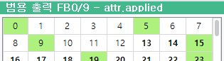
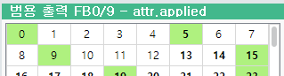

# 3.7 xhost 모듈의 method 호출

xhost는 호스트(로봇제어기)의 기능을 호출하기 위한 다양한 method를 포함하는 모듈입니다.

가상제어기 main이 xhost를 생성하여 python 런타임에 주입시켜 주기 때문에,  import xhost만 하면 사용할 수 있습니다. xhost.py라는 파일은 직접 작성할 필요가 없습니다.


<U>xhost 모듈의 method 참조설명서</U>를 참고하십시오.


<<U>ArgosX와 interface plug-in의 사양</U>에서 에러 처리 관련 아래의 항목이 있었습니다.

ArgosX로부터 "fail"이 수신되면, 미리 설정해 둔 번호의 로봇제어기 범용 I/O 출력신호를 켠다.


로봇제어기의 범용 I/O 출력신호는, 아래 method로 on/off 할 수 있습니다.
``` python 
def io_set_out_bit(sigcode: int, val: int) -> int
```

sigcode는 아래와 같이 io의 block 번호와 인덱스를 하나의 숫자로 합친 code입니다.

sigcode = block번호 x 10000 + 인덱스


가령 fb3.do72의 sigcode는 아래와 같습니다.

3 x 10000 + 72 = 30072


val는 ON일 때 1, OFF일 때 0입니다.


ArgosX 에러를 위한 출력신호 할당 번호를 sigcode_err라는 이름의 모듈 변수로 추가하고 default 값은 5 (즉, fb0.do5)로 설정합니다.

(attribute로 선언하여 HRScript에서 변경 가능하게 할 수도 있지만, 이 예제에서는 생략합니다.)


setup.py
```python 
..이전 생략
ip_addr : str = "192.168.1.100"
port : int = 54321
sigcode_err = 5
```

 res( ) 함수 내에서 수신된 msg 값을 "res fail"과 비교하고, 결과에 따라 출력신호를 내보냅니다.


roblang.py
```python
.. 이전 생략
  
  
import xhost
  
  
...생략
 
 
def res() -> str:
   """
   wait response from ArgosX
   Returns:
      response string from ArgosX
      "" if failed.
      e.g. "[30, 25.7, 11.9, 31.6, 12.8, -54.6]"
   """
   val = 0
   msg = comm.recv_msg()
   print(msg)
   if msg=="res fail":
      val = 1
      msg = ""
   else:
      msg = get_base_shift_array_from_res(msg)
   xhost.io_set_out_bit(setup.sigcode_err, val)
   return msg
```

가상제어기를 재 실행하고, 티치펜던트의 범용 출력 panel을 열어놓은 상태에서, job 프로그램을 다시 실행해 봅시다.

fail이 아니므로 이전과 동일한 동작일 것이며, fb0.do5번 출력신호도 켜지지 않을 것입니다.

argosx_stub.py는 98번 work를 요청하면 무조건 fail을 응답하게 만들어져 있습니다. 아래와 같이 req(98)을 수행하도록 job을 수정한 후 다시 실행해봅시다.


job
```
...이전 생략
 
 
     iret=argosx.req(98) # 요청 송신
     if iret<0
       print "req error"
       stop
     endif
      
     var str=argosx.res() # 응답 대기
     print str
     if str==""
       print "req error"
       stop
     else
       var sft=Shift(str) # shift 배열 문자열을 shift 데이터로 변환
       print sft.x, sft.y, sft.z, sft.rx, sft.ry, sft.rz
     endif
 
     argosx.close() # socket 닫기
     end
```

res( )를 수행하는 순간  fb0.do5번 출력신호가 켜진다면, 정상적으로 에러신호가 출력된 것입니다.




5번 신호는 ArgosX의 에러를 위해서만 사용되어야 하므로, 할당 신호로 지정해 두어야 다른 응용에서 사용할 수 없을 것입니다.


아래 xhost의 method로 특정 sigcode를 할당으로 지정해둘 수 있습니다.
```python 
def io_assign_set_out_bit(sigcode: int) -> int
```

main.py에 on_app_init( )라는 함수를 정의한 후, 아래와 같이 할당을 지정하는 루틴을 넣어두면, argosx가 import 되는 순간 실행됩니다.


main.py
```python 
.. 이전 생략
 
 
import xhost
 
 
...생략
 
 
def on_app_init() -> int:
   """(callback) called just after self-diagnosis
   Returns:
      0
   """
   print('[argosx] on_app_init();')
   xhost.io_assign_set_out_bit(setup.sigcode_err)
   return 0
```

가상제어기를 재실행하고 job에서 import argosx가 실행된 후, 범용 출력 panel을 다시 여십시오.

지정한 신호가 할당(bold체)으로 표시됩니다.

