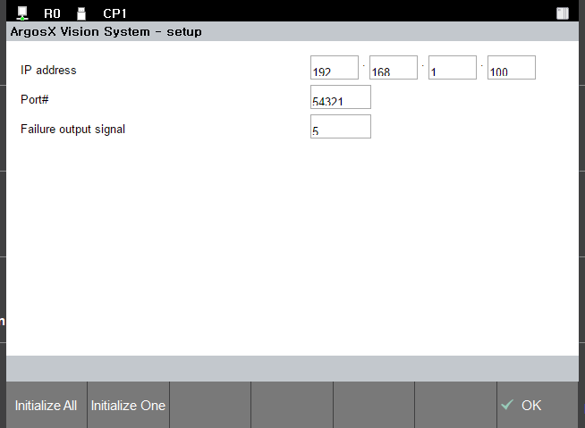

# 3.3.1 ArgosX의 설정화면 사용자 인터페이스의 사양

아래와 같은 사양으로 설정화면 사용자 인터페이스를 만들어 봅시다.

* 설정 - 응용 파라미터 메뉴에 ArgosX 설정 화면에 진입하는 메뉴가 있다.
* ArgosX 설정화면에서 ArgosX 장치의 IP 주소와 port 번호를 설정할 수 있다.
* 설정 내용은 argosx.json 파일에 json 파일 형식으로 저장된다.
* 화면 전체를 default 값으로 만드는 F버튼 (Initialize All)을 제공한다.
* 현재 선택한 항목만 default 값으로 만드는 F버튼 (Initialize One)을 제공한다.

job 프로그램에서의 import argosx 의 수행 여부와 무관하게, 설정화면을 열고 설정값을 확인/변경할 수 있게 하고자 합니다.

argosx/info.json 파일의 startup 항목을 "manual"에서 "boot"로 바꿉니다. 이제, 제어기 booting 시에 argosx가 import 되므로, job 프로그램에서 import argosx 를 수행할 필요가 없습니다.

(여전히, HRScript에서 설정할 수도 있습니다.)