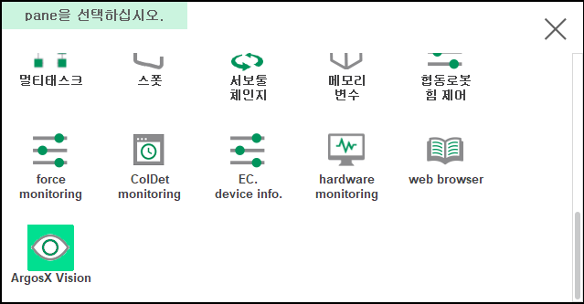
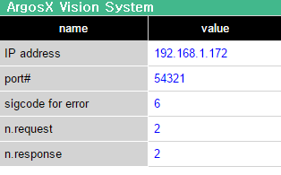

# 3.4.4 panel 메뉴의 주입

ArgosX의 모니터링 기능을, panel 메뉴에 주입해봅시다.

ui/menu.json 파일에 아래와 같이 panel 항목을 추가합니다.

menu.json
``` json
[
   {
       "path": "system/appl/",
       "id": "argosx",
       "icon": "argosx/ui/lm_argosx.png",
       "label": "ArgosX Vision",
       "url": "argosx/ui/setup.html"
   },
   {
      "path": "panels",
      "id": "argosx",
      "icon": "argosx/ui/panel_argosx.png",
      "label": "ArgosX Vision",
      "url": "argosx/ui/panel.html"
  }
]
```

panel 메뉴에 주입할 그림 icon을 제작해봅시다. 40x40 투명배경의 png icon 형태이면 됩니다.

기존 lm_argosx.png를 적당히 축소한 후 색상을 조정하여 panel_argosx.png를 만들었습니다.


panel_argosx.png의 예 (이 그림을 다운받아 사용해도 됩니다.)


이제 가상 메인보드과 가상 티치펜던트를 재실행 합니다.


새로운 panel을 추가하기 위해 panel 메뉴를 열면, 맨 아래에 새로 추가된 ArgosX Vision 메뉴 항목이 보입니다.



메뉴를 선택하면 잠시 후, 우리가 작성한 모니터링 panel이 나타납니다.



가상 티치펜던트를 조작해, 요청과 응답을 수행해봅시다. n.request와 n.response 값이 증가하면 정상입니다.

