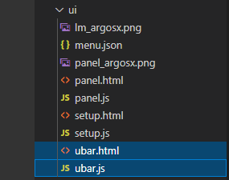
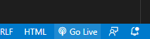
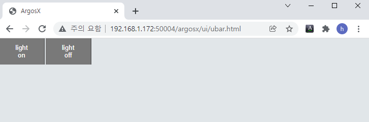

# 3.5.2 사용자 막대의 레이아웃

argosx 의 부모인 apps/ 폴더에 대해 vscode를 여십시오.

ui/ubar.html 와 ui/ubar.js 파일을 생성합니다.
<br>

내용은 아래와 같이 작성합니다. 2개의 button으로 구성된 간단한 layout입니다. table의 첫번째 열에는 'ubar-bt' 이라는 class를 부여했는데, 이 class는 공용 style.css에 정의되어 있습니다. TP600과 TP630을 자동으로 인식하여 기본 U/I와 유사한 버튼 크기와 색상을 부여해줍니다. 스타일을 바꾸고 싶다면, 별도의 local css로 class를 정의하여 적용해도 됩니다.

ubar.html
``` html
<!DOCTYPE html:5>
<!--
   @author: Jane Doe, BlueOcean Robot & Automation, Ltd.
   @brief: ArgosX Vision System interface - bar
   @create: 2021-12-07
-->
<html>
  
<head>
    <title>ArgosX</title>
    <link rel='stylesheet' href='../../_common/css/style.css' type=text/css rel=stylesheet>
    <script src='../../_common/js/jquery-3.6.0.min.js'></script>
    <script src='./ubar.js'></script>
</head>
  
<body class='ubar'>
   <button id='light-on' class='ubar-bt' onclick='light_onoff(true);'>light<br>on</button>
   <button id='light-off' class='ubar-bt' onclick='light_onoff(false);'>light<br>off</button>
</body>
</html>
```

ubar.html이 열린 상태에서 우하단의 Go Live 버튼을 클릭하여 Live server를 실행하면 Chrome 브라우저가 열립니다.
<br>


아직 ubar.js의 내용은 없지만, 레이아웃이 정상적인지는 확인할 수 있습니다.
<br>