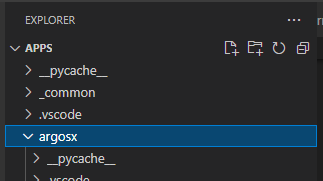
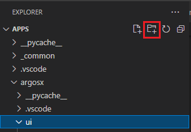
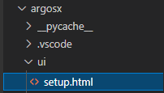
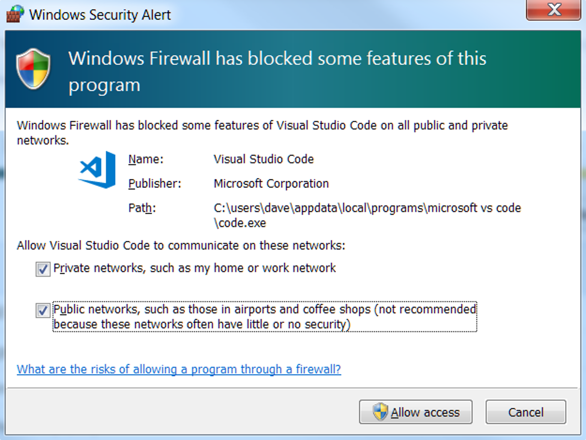
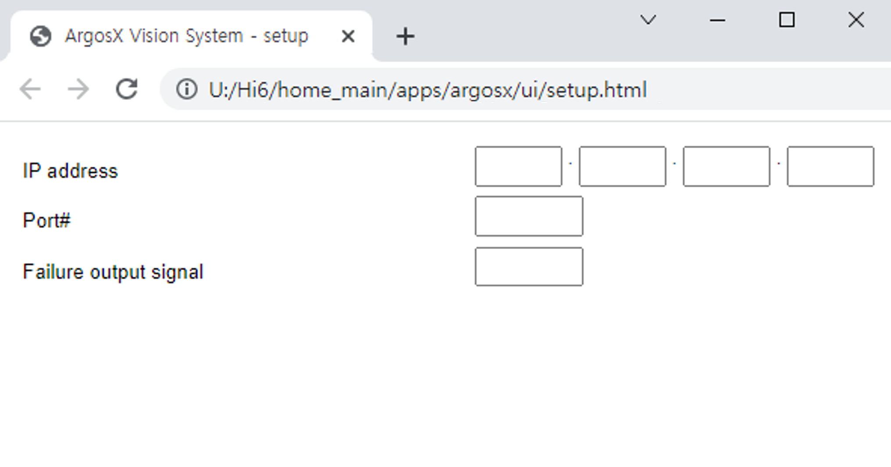

### 3.3.2 设置屏幕的布局

打开包含 ArgosX 文件夹的 apps/ 文件夹的 vscode。

（此步骤是因为 ArgosX 用户界面需要引用 apps/_common/ 中的文件。应将包含所有由 Live server 引用的文件的文件夹作为工作区中的顶级文件夹打开。）
<br>

<br>

通过单击新建文件夹按钮创建 ui/ 文件夹。
<br>

<br>

创建 ui/setup.html 文件。
<br>

<br>

将内容写入如下。

setup.html
``` html
<!DOCTYPE html:5>
<!--
   @author: Jane Doe, BlueOcean Robot & Automation, Ltd.
   @brief: ArgosX 视觉系统接口 - 设置
   @create: 2021-12-06
-->
<html>
  
<head>
   <title>ArgosX 视觉系统 - 设置</title>
   <meta http-equiv=Content-Type content='text/html; charset=utf-8'>
   <link rel='stylesheet' href='../../_common/css/style.css' type=text/css rel=stylesheet>
</head>
  
<body>
   <div>
      <div id='contents'>
         <span class='col0' name='ip_addr'>IP 地址</span>
         <input class='col1' type='text' name='ip_addr' id='ip_addr_0' size='3'/>
         .
         <input class='col1' type='text' name='ip_addr' id='ip_addr_1' size='3'/>
         .
         <input class='col1' type='text' name='ip_addr' id='ip_addr_2' size='3'/>
         .
         <input class='col1' type='text' name='ip_addr' id='ip_addr_3' size='3'/>
         <br>
         <span class='col0' name='port'>端口#</span>
         <input class='col1' type='text' id='port' size='5'/>
         <br>
         <span class='col0' name='fail_out_sig'>故障输出信号</span>
         <input class='col1' type='text' id='fail_out_sig' size='5'/>
      </div>
   </div>
</body>
</html>
```

当 setup.html 被打开时，点击右下角的 Go Live 按钮以运行 Live server。
<br>

<br>

如果出现关于 vscode 的安全警告，请勾选“允许通信”下的所有项目并点击“允许访问”按钮。
<br>

<br>

另外，您可以通过右键点击 setup.html 打开弹出菜单，然后选择“通过 Live Server 打开”。
<br>

<br>

当 Google Chrome 浏览器打开时，我们可以检查草图布局。

setup.html 的草图布局
<br>

<br>