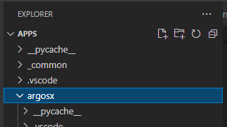
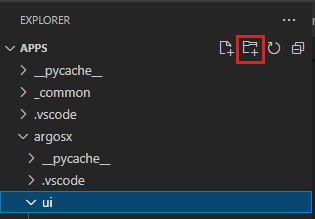
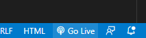

# 3.3.2 설정화면의 레이아웃


argosx 의 부모인 apps/ 폴더에 대해 vscode를 여십시오.

(이렇게 하는 이유는 argosx의 사용자 인터페이스가 apps/_common/의 파일을 참조해야 하기 때문입니다. Live server가 참조하는 파일들을 모두 포함하는 폴더를 workspace의 최상위 폴더로서 열어야 합니다.)
</br>

</br>


New Folder 버튼을 클릭하여 ui/ 폴더를 만듭니다.
</br>

</br>


ui/setup.html 파일을 생성합니다.
</br>

</br>


내용은 아래와 같이 작성합니다.


setup.html
``` html
<!DOCTYPE html:5>
<!--
   @author: Jane Doe, BlueOcean Robot & Automation, Ltd.
   @brief: ArgosX Vision System interface - setup
   @create: 2021-12-06
-->
<html>
  
<head>
   <title>ArgosX Vision System - setup</title>
   <meta http-equiv=Content-Type content='text/html; charset=utf-8'>
   <link rel='stylesheet' href='../../_common/css/style.css' type=text/css rel=stylesheet>
</head>
  
<body>
   <div>
      <div id='contents'>
         <span class='col0' name='ip_addr'>IP address</span>
         <input class='col1' type='text' name='ip_addr' id='ip_addr_0' size='3'/>
         .
         <input class='col1' type='text' name='ip_addr' id='ip_addr_1' size='3'/>
         .
         <input class='col1' type='text' name='ip_addr' id='ip_addr_2' size='3'/>
         .
         <input class='col1' type='text' name='ip_addr' id='ip_addr_3' size='3'/>
         <br>
         <span class='col0' name='port'>Port#</span>
         <input class='col1' type='text' id='port' size='5'/>
         <br>
         <span class='col0' name='fail_out_sig'>Failure output signal</span>
         <input class='col1' type='text' id='fail_out_sig' size='5'/>
      </div>
   </div>
</body>
</html>
```

setup.html이 열린 상태에서 우하단의 Go Live 버튼을 클릭하여 Live server를 실행합니다.
</br>

</br>


혹시 Visual Studio Code에 대한 보안 경고가 나타나면, 통신 허용을 모두 체크하고 액세스 허용 버튼을 클릭해주십시오.
</br>

</br>


혹은, setup.html에 대해 우버튼으로 팝업 메뉴를 열고 "Open with Live Server"를 선택합니다.
</br>

</br>


Chrome 브라우저가 열리면서, 대략적인 레이아웃을 확인할 수 있습니다.


setup.html의 대략적인 레이아웃
</br>

</br>


