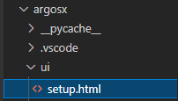
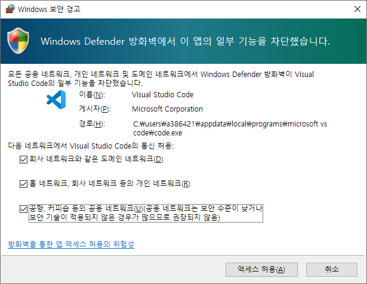
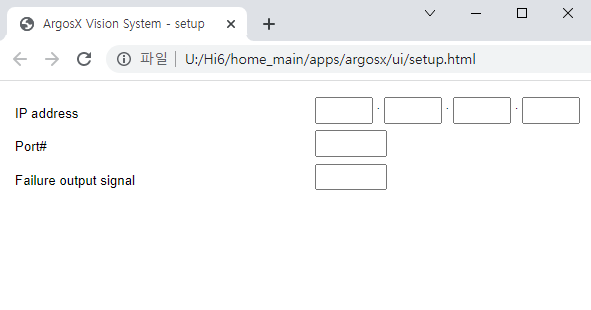

# 3.3.2 The layout of the setup screen


Open vscode for the apps/ folder that is the parent of the ArgosX folder.

(This step is performed because the ArgosX user interface needs to refer to the files in apps/_common/. A folder containing all the files referred to by the Live server should be opened as a top-level folder in the workspace.)
</br>

</br>


Create a ui/ folder by clicking the New Folder button.
</br>

</br>


Create a ui/setup.html file.
</br>

</br>


Write the content as follows. 


setup.html
``` html
<!DOCTYPE html:5>
<!--
   @author: Jane Doe, BlueOcean Robot & Automation, Ltd.
   @brief: ArgosX Vision System interface - setup
   @create: 2021-12-06
-->
<html>
  
<head>
   <title>ArgosX Vision System - setup</title>
   <meta http-equiv=Content-Type content='text/html; charset=utf-8'>
   <link rel='stylesheet' href='../../_common/css/style.css' type=text/css rel=stylesheet>
</head>
  
<body>
   <div>
      <div id='contents'>
         <span class='col0' name='ip_addr'>IP address</span>
         <input class='col1' type='text' name='ip_addr' id='ip_addr_0' size='3'/>
         .
         <input class='col1' type='text' name='ip_addr' id='ip_addr_1' size='3'/>
         .
         <input class='col1' type='text' name='ip_addr' id='ip_addr_2' size='3'/>
         .
         <input class='col1' type='text' name='ip_addr' id='ip_addr_3' size='3'/>
         <br>
         <span class='col0' name='port'>Port#</span>
         <input class='col1' type='text' id='port' size='5'/>
         <br>
         <span class='col0' name='fail_out_sig'>Failure output signal</span>
         <input class='col1' type='text' id='fail_out_sig' size='5'/>
      </div>
   </div>
</body>
</html>
```

While setup.html is opened, click the Go Live button on the bottom right to run the Live server.
</br>

</br>


If a security warning about vscode appears, tick all items under Permit Communications and click the Allow Access button.
</br>

</br>


Alternatively, you should open a pop-up menu by right-clicking the mouse on setup.html, then select "Open with Live Server."
</br>

</br>


When the Google Chrome browser opens, we can check the sketchy layout.


Sketchy layout of setup.html
</br>

</br>


