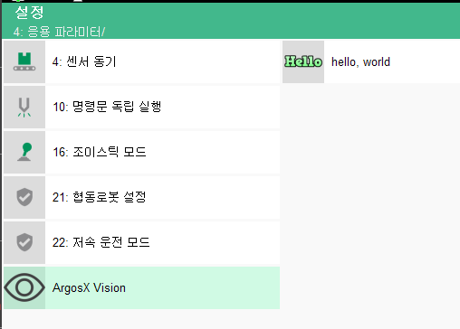
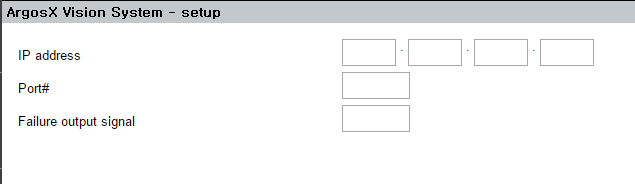

# 3.3.4 Injecting a menu into the description screen

We have already practiced injecting a menu through the hello_world example.

Let's inject the ArgosX setup screen under the System - Application Parameter menu of the teach pendant.


Create a menu.json file, as shown below, under the ui/ folder.


menu.json
``` json
[
    {
        "path": "system/appl/",
        "id": "argosx",
        "icon": "argosx/ui/lm_argosx.png",
        "label": "ArgosX Vision",
        "url": "argosx/ui/setup.html"
    }
]
```


Let’s inject a picture icon this time. Using the two websites below, we obtained a png icon with a transparent 104 x 104-pixel background. 


Bootstrap Icons (https://icons.getbootstrap.com/#icons): An open source icon library. Icons are provided in an SVG vector file format.

EZGIFCOM (https://ezgif.com/svg-to-png): Performs online conversions of SVG files into PNG files with desired resolutions.

</br></br>
 Example of lm_argosx.png (You can download and use this picture.)


<br></br>

Now, we should run the virtual mainboard and virtual teach pendant again.


When entering the System _ Application Parameter menu, you can find the newly added ArgosX Vision menu item, as shown below.
</br>

</br>


When you select the menu, the layout we wrote will appear shortly.
</br>

</br>


