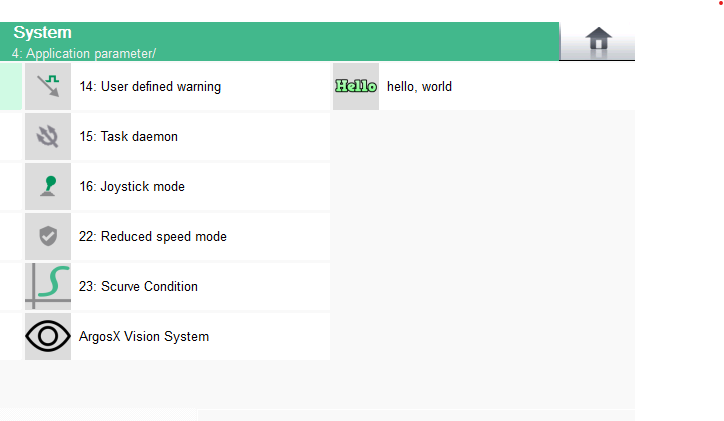
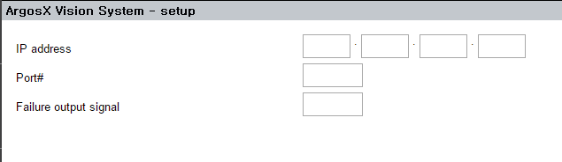

### 3.3.4 将菜单注入到描述屏幕

我们已经通过 hello_world 示例练习了注入菜单。

现在，让我们在教学挂件的系统 - 应用参数菜单下注入 ArgosX 设置屏幕。


在 ui/ 文件夹下创建一个 menu.json 文件，如下所示。


menu.json
``` json
[
    {
        "path": "system/appl/",
        "id": "argosx",
        "icon": "argosx/ui/lm_argosx.png",
        "label": "ArgosX 视觉",
        "url": "argosx/ui/setup.html"
    }
]
```


这次我们要注入一个图片图标。通过以下两个网站，我们获得了一个透明背景为 104 x 104 像素的 png 图标。


Bootstrap Icons (https://icons.getbootstrap.com/#icons)：一个开源图标库。图标以 SVG 矢量文件格式提供。

EZGIFCOM (https://ezgif.com/svg-to-png)：在线将 SVG 文件转换为所需分辨率的 PNG 文件。

<br></br>
 lm_argosx.png 的示例（您可以下载并使用此图片。）


<br></br>

现在，我们应该再次运行虚拟主板和虚拟教学挂件。


当进入系统 _ 应用参数菜单时，您可以找到新添加的 ArgosX 视觉菜单项，如下所示。
<br>

<br>


当您选择该菜单时，我们编写的布局将很快出现。
<br>

<br>