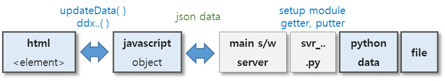
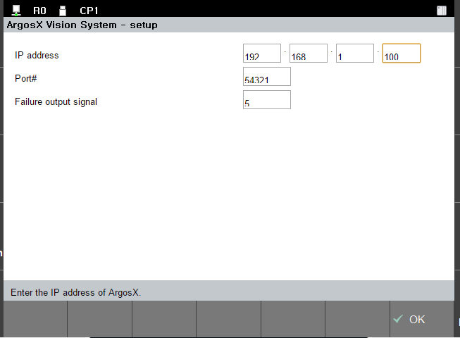

### 3.3.5 加载和保存设置屏幕的值

当设置屏幕打开时，保存在 Python 插件中的设置值将作为中间 JavaScript 对象加载，然后作为 HTML 元素显示在屏幕上。

当用户修改值并点击 [OK] 按钮时，屏幕上的 HTML 元素将被创建为中间 JavaScript 对象，并保存到 Python 插件中的变量中。

要执行传输，请实现 JavaScript 的 updateData( ) 函数以及 Python 的 setup 模块的 getter 和 putter 函数。
<br></br>



##### 元素 ↔ javascript 对象

setup.js

``` js
Previous steps skipped...
 
 
///@param[in]  data
///@param[in]  to_data     true; element->data, false; element<-data
function updateData(data, to_data)
{
   ddx_edit_ip(data, 'ip_addr', to_data);
   ddx_edit_i(data, 'port', to_data);
   ddx_edit_sig(data, 'sigcode_err', to_data);
}
```

元素和 JavaScript 对象之间值的双向传输由 updateData( ) 函数定义。参数 data 是一个 JavaScript 对象，而 to_data 是一个布尔变量，指示传输的方向。如果为 true，则方向为从元素到数据；如果为 false，则方向为从数据到元素。

我们也可以直接使用文档对象模型应用程序接口（DOM API）或 jQuery 来实现传输。然而，通过使用 dst_setup.js 提供的动态数据交换（DDX）函数，可以更简洁地实现传输。
<br></br>

DDX 函数 

|函数签名|HTML 元素|数据类型|描述|
|---|---|---|---|
|ddx_edit(data, name, to_data)|```<input type='text'>```|string||
|ddx_edit_i(data, name, to_data)|```<input type='text'>```|integer||
|ddx_edit_sig(data, name, to_data)|```<input type='text'>```|integer|如果设置通用 I/O 信号的元素值为 sigcode，则它将原样传输。<br>如果值的形式为 fb?.?，则将其转换为 sigcode 并传输。|
|ddx_edit_ip(data, name, to_data)|```<input type='text'>``` x 4 (单位)|string|用于设置 IP 地址。<br>如果名称为 'ip'，则四个元素的每个 ID 应为 'ip_0'，'ip_1'，'ip_2'，和 'ip_3'。<br>数据将被保存为 "xxx.xxx.xxx.xxx."|
|ddx_check(data, name, to_data)|```<input type='checkbox'>```|boolean||
|ddx_radio(data, name, to_data)|```<input type='radio'>```x N (单位)|integer|每个单选元素应具有唯一的值属性。|
<br>

##### javascript object ↔ python data


setup.js
``` js
///@author: Jane Doe, BlueOcean Robot & Automation, Ltd.
///@brief: ArgosX Vision System interface - setup general
///@create: 2021-12-06
 
 
 
function init()
{
   setDomPath('/apps/argosx/svr_general');
   setUpdateGuideBar(updateGuideBar);
   setUpdateData(updateData);
   onReady();
}
 
 
...Subsequent steps skipped
```

在初始化步骤中，使用 setDomPath( ) 函数指定了 "/apps/argosx/svr_general" 路径。

所有插件，包括 ArgosX，将在 /apps/ 下部署，路径的最后名称为 "svr_"，附加上设置组名称。

<br></br>

**/apps/{应用程序名称}/svr_{设置组名称}**

<br></br>
一个插件可以有一个或多个设置屏幕，一个屏幕上的数据将被视为一个对象，并称为设置组。每个设置组可以自由命名，该名称成为设置组名称。在这个例子中，设置组名称被确定为 'general'。

如果您在设置组名称前添加前缀 "get_" 或 "put_"，而不是 "svr_"，它将分别成为 getter 或 putter 服务函数名称。此外，如果在 getter 函数名称的末尾添加 '_def'，它将成为获取默认值的默认 getter 服务函数名称。

因此，在上述例子中，默认 getter、getter 和 putter 服务函数名称将分别变为 get_general_def( )、get_general( ) 和 put_general( )。


将 setup.py 文件添加到项目文件夹 argosx/.
<table>
  <thead>
    <tr>
      <th style="text-align:left"></th>
      <th style="text-align:left">功能</th>
<<<SOURCE_MARKDOWN_START>>>      <th style="text-align:left">调用发生的时间点</th>
      <th style="text-align:left">操作</th>
    </tr>
  </thead>
  <tbody>
    <tr>
      <td>默认获取器</td>
      <td>get_general_def( )</td>
      <td>当请求默认值时。</td>
      <td>每个默认设置值将作为属性值保存到一个对象中，所有对象将被返回。</td>
    </tr>
    <tr>
      <td>dgetter</td>
      <td>get_general( )</td>
      <td>当设置屏幕打开时。</td>
      <td>每个Python插件拥有的默认设置值将作为属性值保存到一个对象中，所有对象将被返回。</td>
    </tr>
    <tr>
      <td>putter</td>
      <td>put_general( )</td>
      <td>当使用[OK]或[应用]按钮保存设置屏幕的值时。</td>
      <td>传递给body参数的属性值将被读取并保存在Python插件中。</td>
    </tr>
  </tbody>
</table>


<br>

现在，让我们实现各个函数。每个属性的键应与DDX函数中使用的名称相同。

setup.py
``` python

""" robot application - argosx - setup
 
 
@author:    Jane Doe, BlueOcean Robot & Automation, Ltd.
@created:   2021-12-06
"""
 
 
def get_general_def() -> dict:
   """
   Returns:
      默认设置值
   """
   print('def_general_def()')
 
 
   data_def = {
      'ip_addr': '192.168.1.100',
      'port' : 54321,
      'sigcode_err': 5
   }
    
   return data_def
 
 
def get_general() -> dict:
   """
   Returns:
      设置字典。
   """
 
   print('get_general()')
    
   ret = {}
   ret["ip_addr"] = ip_addr
   ret["port"] = port
   ret["sigcode_err"] = sigcode_err
    
   return ret
 
    
def put_general(body: dict) -> int:
   """
   Args:
      body  设置字典。
    
   Returns:
      0
   """
   global ip_addr, port, sigcode_err
   print('put_general()')
 
   ip_addr = body["ip_addr"]
   port = body["port"]
   sigcode_err = body["sigcode_err"]
 
   save_to_setup_file(body) # 保存到文件
    
   return 0
```<<<SOURCE_MARKDOWN_END>>>
关于在 setup.py 中全局变量的初始化，让我们将当前的方法更改为使用默认获取函数的方法，以便代码不会重复。

setup.py
``` python
...以前的步骤省略

gen_def = get_general_def()
ip_addr : str = gen_def['ip_addr']
port : int = gen_def['port']
sigcode_err = gen_def['sigcode_err']
```

##### 操作测试

现在，让我们重启虚拟控制器，导入 ArgosX，然后进入 ArgosX 设置屏幕。默认设置值将显示如下。
<br>  <br>

将 IP 地址更改为 192.168.1.172，在故障输出信号中输入 3.4，然后按 <Enter> 将其值更改为 fb3.4。之后，按 [OK] 按钮退出屏幕。
<br>

当你再次进入屏幕时，如果新设置的值正常显示，则意味着操作正常。
<br>  <br>