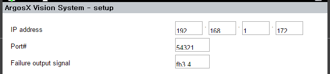

# 3.3.5 Loading and saving the values of the setup screen


When the setup screen is opened, the setup values saved in the Python plug-ins will be loaded as intermediate JavaScript objects, then displayed as HTML elements on the screen.

When the user modifies the values and clicks the [OK] button, the HTML elements on the screen will be created as intermediate JavaScript objects and saved into the variables within the Python plug-ins.


To perform the transfer, implement JavaScript's updateData( ) function and the getter and putter functions of Python's setup module.
<br></br>


## element ↔ javascript object


setup.js
``` js
Previous steps skipped...
 
 
///@param[in]  data
///@param[in]  to_data     true; element->data, false; element<-data
function updateData(data, to_data)
{
   ddx_edit_ip(data, 'ip_addr', to_data);
   ddx_edit_i(data, 'port', to_data);
   ddx_edit_sig(data, 'sigcode_err', to_data);
}
```


The two-way transfer of values between an element and a JavaScript object is defined with the updateData( ) function. The parameter data is a JavaScript object, while to_data is a boolean variable and indicates the direction of the transfer. If it is true, the direction will be from element to data, while if it is false, the direction will be from data to element.

We can also implement the transfer directly using the document object model application programming interface (DOM API) or jQuery. However, the transfer can be implemented more concisely by using the dynamic data exchange (DDX) functions provided by dst_setup.js.
<br></br>

DDX functions 

|Function signature|HTML element|Data type|Description|
|---|---|---|---|
|ddx_edit(data, name, to_data)|```<input type='text'>```|string||
|ddx_edit_i(data, name, to_data)|```<input type='text'>```|integer||
|ddx_edit_sig(data, name, to_data)|```<input type='text'>```|integer|If the value of the element for setting the universal I/O signals is sigcode, it will be transmitted as is.</br>If the value is in the form of fb?.?, it will be converted to sigcode and transmitted.|
|ddx_edit_ip(data, name, to_data)|```<input type='text'>``` x 4 (units)|string|This is for setting an IP address.</br>If the name is 'ip', each ID of the four elements should be 'ip_0', 'ip_1', 'ip_2', and 'ip_3'.</br>The data will be saved as "xxx.xxx.xxx.xxx."|
|ddx_check(data, name, to_data)|```<input type='checkbox'>```|boolean||
|ddx_radio(data, name, to_data)|```<input type='radio'>```x N (units)|integer|Each radio element should have a unique value attribute.|

</br>

## javascript object ↔ python data


setup.js
``` js
///@author: Jane Doe, BlueOcean Robot & Automation, Ltd.
///@brief: ArgosX Vision System interface - setup general
///@create: 2021-12-06
 
 
 
function init()
{
   setDomPath('/apps/argosx/svr_general');
   setUpdateGuideBar(updateGuideBar);
   setUpdateData(updateData);
   onReady();
}
 
 
...Subsequent steps skipped
```

During the initialization step, the "/apps/argosx/svr_general" path was designated with the setDomPath( ) function.

All plug-ins, including ArgosX, will be deployed under /apps/, and the last name of the path is "svr_" with the setup group name attached to it.

<br></br>

**/apps/{app name}/svr_{setup group name}**

<br></br>
A plug-in can have one or more setup screens, and the data on one screen will be treated as one object and referred to as a setup group. Each setup group can be named freely, and that name becomes the setup group name. In this example, the setup group name is determined as 'general.'

If you append the prefix "get_" or "put_", instead of "svr_", to a setup group name, it will become the getter or putter service function name, respectively. Moreover, if you add '_def' at the end of the getter function name, it will become the name of the default getter service function that acquires the default value.


Accordingly, in the example above, the default getter, getter, and putter service function names will become get_general_def( ), get_general( ), and put_general( ), respectively.


Add the setup.py file into the project folder argosx/.
<table>
  <thead>
    <tr>
      <th style="text-align:left"></th>
      <th style="text-align:left">Function</th>
      <th style="text-align:left">Point in time when calling occurs</th>
      <th style="text-align:left">Operation</th>
    </tr>
  </thead>
  <tbody>
    <tr>
      <td>default getter</td>
      <td>get_general_def( )</td>
      <td>When the default value is requested.</td>
      <td>Each default setup value will be saved into an object as an attribute value, and all of the objects will be returned.</td>
    </tr>
    <tr>
      <td>dgetter</td>
      <td>get_general( )</td>
      <td>When the setup screen is opened./td>
      <td>Each default setup value that a Python plug-in has will be saved into an object as an attribute value, and all objects will be returned.</td>
    </tr>
    <tr>
      <td>putter</td>
      <td>put_general( )</td>
      <td>When the values of the setup screen are saved with the [OK] or [Apply] buttons.</td>
      <td>The attribute values transferred to the body parameter will be read and saved in the Python plug-ins.</td>
    </tr>
  </tbody>
</table>


</br>

Now, let's implement individual functions. Each attribute's key should be the same name used in the DDX function.

setup.py
``` python

""" robot application - argosx - setup
 
 
@author:    Jane Doe, BlueOcean Robot & Automation, Ltd.
@created:   2021-12-06
"""
 
 
def get_general_def() -> dict:
   """
   Returns:
      default value of setting
   """
   print('def_general_def()')
 
 
   data_def = {
      'ip_addr': '192.168.1.100',
      'port' : 54321,
      'sigcode_err': 5
   }
    
   return data_def
 
 
def get_general() -> dict:
   """
   Returns:
      setting dict.
   """
 
   print('get_general()')
    
   ret = {}
   ret["ip_addr"] = ip_addr
   ret["port"] = port
   ret["sigcode_err"] = sigcode_err
    
   return ret
 
    
def put_general(body: dict) -> int:
   """
   Args:
      body  setting dict.
    
   Returns:
      0
   """
   global ip_addr, port, sigcode_err
   print('put_general()')
 
   ip_addr = body["ip_addr"]
   port = body["port"]
   sigcode_err = body["sigcode_err"]
 
   save_to_setup_file(body) # save to file
    
   return 0
```

Regarding the initialization of the global variables in setup.py, let's change the current method to another that uses the default getter function so that the code will not be duplicated.


setup.py
``` python
...Previous steps skipped
 
 
gen_def = get_general_def()
ip_addr : str = gen_def['ip_addr']
port : int = gen_def['port']
sigcode_err = gen_def['sigcode_err']
```


## Operation test


Now, let’s restart the virtual controller, import ArgosX, then enter the ArgosX setup screen. The default setup values will be shown as follows.
</br>  </br>


Change the IP address to 192.168.1.172, type 3.4 into Failure output signal, then press <Enter> to change its value to fb3.4. After that, press the [OK] button to exit the screen.
</br>

When you enter the screen again, if the newly set values are displayed well, it means the operation is normal.
</br>  </br>


