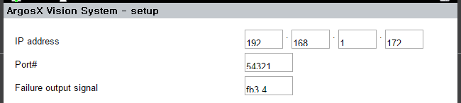

### 3.3.6 加载和保存设置文件

在上一节中，我们练习了将设置值保存到Python变量中并重新加载。

为了在关闭和打开控制器时保持此设置，它应该保存在一个文件中。

添加 `save_to_setup_file( )` 函数，该函数用于将设置保存到文件中，以及 `load_from_setup_file( )` 函数，该函数用于从文件中加载设置，按如下方式添加到setup.py中。

setup.py
``` python 

""" 机器人应用 - argosx - 设置
 
 
@author:    Jane Doe, BlueOcean Robot & Automation, Ltd.
@created:   2021-12-06
"""
 
import xhost
import json
 
 
fname_setup = 'argosx.json'
 
 
def get_general_def() -> dict:
   """
   返回:
      设置的默认值
   """
   print('def_general_def()')
 
   data_def = {
      'ip_addr': '192.168.1.100',
      'port' : 54321,
      'sigcode_err': 5
   }
    
   return data_def
 
 
def get_general() -> dict:
   """
   返回:
      设置字典。
   """
 
   print('get_general()')
    
   ret = {}
   ret["ip_addr"] = ip_addr
   ret["port"] = port
   ret["sigcode_err"] = sigcode_err
    
   return ret
 
    
def put_general(body: dict) -> int:
   """
   参数:
      body  设置字典。
    
   返回:
      0
   """
   global ip_addr, port, sigcode_err
   print('put_general()')
 
   ip_addr = body["ip_addr"]
   port = body["port"]
   sigcode_err = body["sigcode_err"]
 
   save_to_setup_file(body) # 保存到文件
    
   return 0
 
 
def load_from_setup_file() -> int:
   """
   加载设置文件
   返回:
         0     成功
         -1    错误
   """
   global ip_addr, port, sigcode_err
 
   pathname = xhost.abs_path('project') + fname_setup
   try:
      with open(pathname, 'r') as file:
         data = json.load(file)
         ip_addr = data['ip_addr']
         port = data['port']
         sigcode_err = data['sigcode_err']
   except:
      print('未找到文件: ', pathname)
      return -1
   return 0
 
 
def save_to_setup_file(body: dict) -> int:
   """
   保存到设置文件
   返回:
         0     成功
         -1    错误
   """
   pathname = xhost.abs_path('project') + fname_setup
   try:
      with open(pathname, 'w') as file:
         json.dump(body, file, indent='\t')
   except:
      print('文件写入失败: ', pathname)
      return -1
   return 0
 
 
 
# 属性 getter/setter
def get_ip_addr() -> str:
   return ip_addr
 
 
def set_ip_addr(addr: str):
   global ip_addr
   ip_addr = addr
 
def get_port() -> int:
   return port
 
def set_port(_port: int):
   global port
   port = _port
 
gen_def = get_general_def()
ip_addr : str = gen_def['ip_addr']
port : int = gen_def['port']
sigcode_err = gen_def['sigcode_err']
```
我们将调用 save_to_setup_file(body) 作为 put_general( ) 函数的最后一个操作，以将设置屏幕的值保存到 Python 变量中。

此外，我们还在 main.py 的 on_app_init( ) 函数中添加了调用 setup.load_from_setup_file( )，如下所示。当 ArgosX 插件被导入时，setup.load_from_setup_file( ) 将被调用以加载设置。

<br>

main.py
```python 
""" ArgosX Vision System interface - main
 
 
@author:    Jane Doe, BlueOcean Robot & Automation, Ltd.
@created:   2021-12-06
"""
 
from . import setup
from .roblang import *
from .setup import *
from .callback import *
 
import xhost
 
 
def attr_names() -> tuple:
   """Returns the names of the attributes to be exposed."""
   return ("ip_addr", "port")
 
 
def on_app_init() -> int:
   """(callback) called just after self-diagnosis
   Returns:
      0
   """
   print('[argosx] on_app_init();')
   setup.load_from_setup_file()
   xhost.io_assign_set_out_bit(setup.sigcode_err)
   return 0
```
<br>

在这里，让我们重复在上一节中进行的测试。

打开 ArgosX 设置屏幕，修改设置值，例如 IP 地址和输出分配信号，然后通过按 [OK] 键保存它们。

检查项目/ 文件夹中是否创建了 argosx.json 文件，如下所示。

<br>
argosx.json (更改IP地址为192.168.1.172和将错误的输出分配信号设置为fb3.4的示例)

```json
{
    "port": 54321,
    "ip_addr": "192.168.1.172",
    "sigcode_err": 30004
}
```


<br>
再次运行主软件，打开ArgosX设置屏幕。检查文件中保存的设置值是否正常加载。

