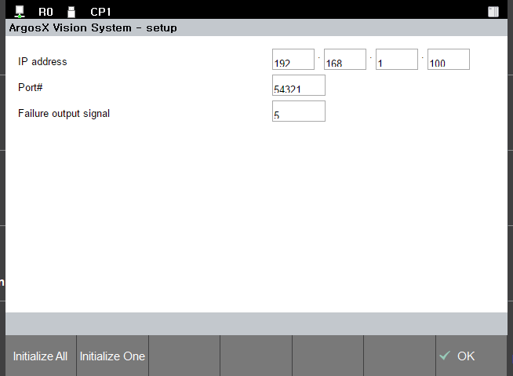

# 3.3.7 F버튼 동작 - default 값으로 초기화


<U>ArgosX의 설정화면 사용자 인터페이스의 사양</U>에서 계획한 대로, 화면의 설정을 default 값으로 만드는 F버튼들을 구현해봅시다.

setup.js에 아래와 같이 InitButtonBar( ) 함수를 추가합니다.

setup.js
``` js
...이전 생략
 
 
function init()
{
   setDomPath(domPath);
   setUpdateGuideBar(updateGuideBar);
   setUpdateData(updateData);
   onReady();
}
 
 
///@return     f-button infos array
function initButtonBar()
{
   console.log('initButtonBar()'); 
   var btn_infos = [
      {
         label: 'Initialize All',
         script: 'setAllValueAsDef();'
      },
      {
         label: 'Initialize One',
         script: 'setSelectedValueAsDef();'
      }
   ]
   return btn_infos;
}
 
 
..이후 생략
```

InitButtonBar( ) 함수는 F버튼 인터페이스를 정의한 객체들의 배열을 리턴합니다. 각 객체 항목은 버튼 레이블을 지정한 속성 label과, 버튼 클릭 시 수행될 javascript를 지정한 속성 script로 구성됩니다.

</br>

InitButtonBar( ) 함수의 리턴값

``` js
[
   {
      label: {label of button-F1},
      script: {script to execute on button-F1 clicked}
   },
   {
      label: {label of button-F2},
      script: {script to execute on button-F2 clicked}
   },
   ....
]
```

위 코드에서 지정한 script는 각각 setAllValueAsDef( ) 함수 호출과 setSelectedValueAsDef( ) 함수 호출입니다. 이들은 dst_setup.js가 기본 제공해주는 함수들입니다.

만일, 다른 동작을 원한다면, 직접 함수를 구현하면 됩니다.

</br>
이제 동작을 시험해봅시다. 가상제어기를 다시 실행한 후, ArgosX 설정화면으로 진입합니다. default와는 다른 값들로 설정을 변경한 후 [OK] 버튼으로 저장합니다.

설정 화면으로 재진입 한 후, 임의의 element에 커서를 두고 Initialize One 버튼을 클릭하여 default 값으로 복원되는지 확인합니다.

또한 Initialize All 버튼을 클릭하여 화면 전체의 값이 default 값으로 복원되는지 확인합니다.

