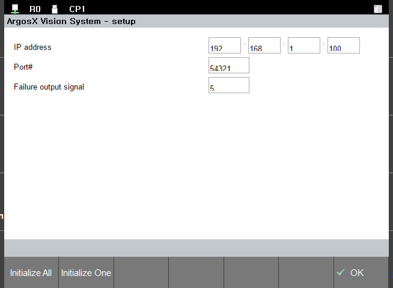

### 3.3.7 操作 F 按钮 - 初始化为默认值

如在 <U>3.3.1 ArgosX 设置屏幕用户界面的规格</U> 中所述，实现用于将屏幕设置初始化为默认值的 F 按钮。

将 InitButtonBar( ) 函数添加到 setup.js，如下所示。

setup.js
``` js
...前面的步骤省略
 
 
function init()
{
   setDomPath(domPath);
   setUpdateGuideBar(updateGuideBar);
   setUpdateData(updateData);
   onReady();
}
 
 
///@return     f-button infos 数组
function initButtonBar()
{
   console.log('initButtonBar()'); 
   var btn_infos = [
      {
         label: '初始化所有',
         script: 'setAllValueAsDef();'
      },
      {
         label: '初始化一个',
         script: 'setSelectedValueAsDef();'
      }
   ]
   return btn_infos;
}
 
 
..后续步骤省略
```

InitButtonBar( ) 函数返回一个对象数组，定义了 F 按钮的接口。每个对象项由一个属性 label 组成，表示按钮标签，以及一个属性 script，表示在单击按钮时要执行的 JavaScript 代码。

<br>

InitButtonBar( ) 函数的返回值

``` js
[
   {
      label: {button-F1 的标签},
      script: {button-F1 单击时执行的脚本}
   },
   {
      label: {button-F2 的标签},
      script: {button-F2 单击时执行的脚本}
   },
   ....
]
```

上述代码中指定的脚本分别用于调用 setAllValueAsDef( ) 函数和 setSelectedValueAsDef( ) 函数。这些函数是默认由 dst_setup.js 提供的。

如果你想要其他操作，你需要自己实现相关函数。

<br>
让我们测试操作。再次运行虚拟控制器并进入 ArgosX 设置屏幕。之后，改变设置为与默认值不同的值，然后通过单击 [OK] 按钮保存它们。

再次进入设置屏幕，并将光标放在任意元素上。之后，单击初始化一个按钮，检查默认值是否恢复。

此外，单击初始化所有按钮，检查屏幕上的所有值是否恢复为默认值。

