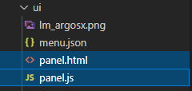
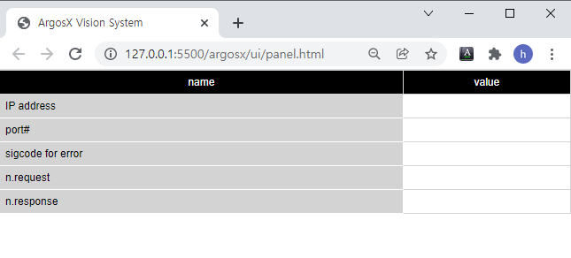

# 3.4.2 Layout of the monitoring panel

Open vscode for the apps/ folder that is the parent of the ArgosX folder.


Create ui/panel.html and panel.js files.




Write the content as follows, which is about a simple layout consisting of one table. The first column of the table is given a class called 'thd' (abbreviation for table header), and this class is defined in the common style.css with black characters on a gray background. If you want to change the style, you can define a class using a separate local css and apply it.


panel.html
``` html
<!DOCTYPE html:5>
<!--
   @author: Jane Doe, BlueOcean Robot & Automation, Ltd.
   @brief: ArgosX Vision System interface - panel
   @create: 2021-12-07
-->
<html>
  
<head>
   <title>ArgosX Vision System</title>
   <meta http-equiv=Content-Type content='text/html; charset=utf-8'>
   <link rel='stylesheet' href='../../_common/css/style.css' type=text/css rel=stylesheet>
   <script src='../../_common/js/jquery-3.6.0.min.js'></script>
   <script src='./panel.js'></script>
   <script>
      $(document).ready(init);
   </script>
</head>
  
<body>
   <table>
      <th>name</th>
      <th>value</th>
      <tr>
         <td class='thd'>IP address</td>
         <td id='ip_addr'></td>
      </tr>
      <tr>
         <td class='thd'>port#</td>
         <td id='port'></td>
      </tr>
      <tr>
         <td class='thd'>sigcode for error</td>
         <td id='sigcode_err'></td>
      </tr>
      <tr>
         <td class='thd'>n.request</td>
         <td id='n_req'></td>
      </tr>
      <tr>
         <td class='thd'>n.response</td>
         <td id='n_res'></td>
      </tr>
   </table>
</body>
</html>
```

While panel.html is open, if you execute Live server by clicking the Go Live button at the bottom right, the Google Chrome browser will open.


<br></br>
Even though there is no content in panel.js yet, we can check whether the layout is normal.



