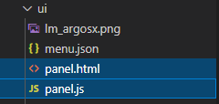
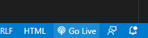
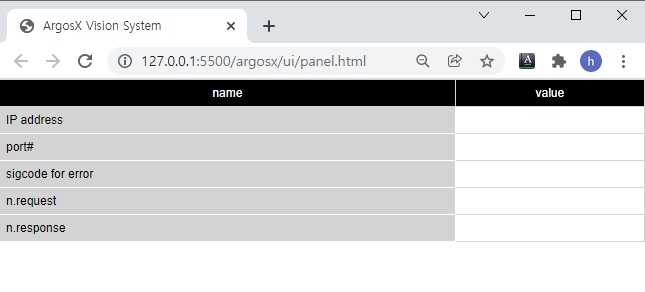

#### 3.4.2 监控面板的布局

打开 vscode，进入 ArgosX 文件夹的父文件夹 apps/。

创建 ui/panel.html 和 panel.js 文件。



写入内容如下，这是一个由一个表格组成的简单布局。表格的第一列被赋予一个名为 'thd' 的类（表示表头），该类在 common style.css 中定义，字符为黑色背景为灰色。如果您想更改样式，可以使用单独的本地 css 定义一个类并应用它。

panel.html
``` html
<!DOCTYPE html:5>
<!--
   @author: Jane Doe, BlueOcean Robot & Automation, Ltd.
   @brief: ArgosX Vision System interface - panel
   @create: 2021-12-07
-->
<html>
  
<head>
   <title>ArgosX 视觉系统</title>
   <meta http-equiv=Content-Type content='text/html; charset=utf-8'>
   <link rel='stylesheet' href='../../_common/css/style.css' type=text/css rel=stylesheet>
   <script src='../../_common/js/jquery-3.6.0.min.js'></script>
   <script src='./panel.js'></script>
   <script>
      $(document).ready(init);
   </script>
</head>
  
<body>
   <table>
      <th>名称</th>
      <th>值</th>
      <tr>
         <td class='thd'>IP 地址</td>
         <td id='ip_addr'></td>
      </tr>
      <tr>
         <td class='thd'>端口#</td>
         <td id='port'></td>
      </tr>
      <tr>
         <td class='thd'>错误的 sigcode</td>
         <td id='sigcode_err'></td>
      </tr>
      <tr>
         <td class='thd'>请求数量</td>
         <td id='n_req'></td>
      </tr>
      <tr>
         <td class='thd'>响应数量</td>
         <td id='n_res'></td>
      </tr>
   </table>
</body>
</html>
```
当 panel.html 打开时，如果您通过点击右下角的 Go Live 按钮执行 Live server，Google Chrome 浏览器将会打开。


<br></br>
尽管 panel.js 中还没有内容，我们仍然可以检查布局是否正常。
