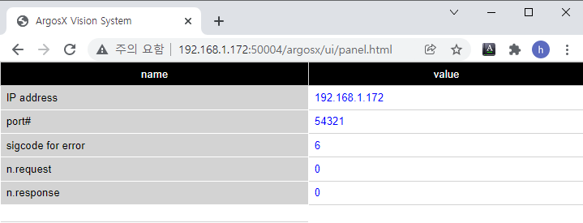

# 3.4.3 Operating the monitoring panel


The Python code already contains the variables for the IP address, port number, and error-assigned input number.

Because it is necessary to manage the request count and response count, we need to add the n_req and n_res variables, as shown below, and connect them to ensure that they can be returned together in the get_general( ) function.


setup.py
``` python 
Previous steps skipped...
 
 
def get_general() -> dict:
   """
   Returns:
      setting dict.
   """
 
   print('get_general()')
    
   ret = {}
   ret["ip_addr"] = ip_addr
   ret["port"] = port
   ret["sigcode_err"] = sigcode_err
   ret["n_req"] = n_req
   ret["n_res"] = n_res
    
   return ret
 
 
skipped...
 
 
gen_def = get_general_def()
ip_addr : str = gen_def['ip_addr']
port : int = gen_def['port']
sigcode_err = gen_def['sigcode_err']
n_req = 0   # request count
n_res = 0   # response count
```

Add the count-up operations of n_requ and n_res to the implementation of the robot language commands.


roblang.py
```python 
Previous steps skipped...
 
 
def req(work_no: int) -> int:
   """
   send request command to ArgosX
   e.g. "req 39"
   Args:
      work_no     work#    1~100
 
 
   Returns:
         >=0   the number of bytes sent
         -1    no socket. init() should be called.
   """
   msg = "req " + str(work_no)
   setup.n_req += 1                           # <---------- add
   return comm.send_msg(msg)
 
 
Skipped...
 
 
def _res_cont(addr_on_timeout: int_or_str) -> str:
   """res() implementation for cont-mode"""
   val = 0
   msg = ""
   timeout = _check_timeout_and_branch(addr_on_timeout)
   if timeout:
      val = 1
   else:
      msg = comm.recv_msg()
      print(msg)
      if msg=="res fail":
         val = 1
         msg = ""
      elif msg=="":
         xhost.req_to_continue()
      else:
         msg = get_base_shift_array_from_res(msg)
         setup.n_res += 1                    # <---------- add
   xhost.io_set_out_bit(setup.sigcode_err, val)
   return msg
```

Write the following content into the ui/panel.js file. The content is about calling the updateData( ) function every 500 msec, getting all the general data from the main board, and injecting them into the html screen through the display( ) function.


ui/panel.js
``` js

///@author: Jane Doe, BlueOcean Robot & Automation, Ltd.
///@brief: ArgosX Vision System interface - panel
///@create: 2021-12-07
 
 
 
function init()
{
   updateData();
   setInterval('updateData()', 500);
}
 
 
///@brief
function updateData()
{
   var path = '/apps/argosx/svr_general';
   var url = domainMb()+path;
   $.get(url, function(data) {
      display(data);
   });
}
 
 
///@return     e.g. "http://192.168.1.150:8888"
function domainMb()
{
   var domain = "http://" + window.location.hostname + ":8888";
   console.log(domain);
   return domain;
}
 
 
///@param[in]  data
///@brief      (callback function) form <- data
function display(data)
{
   console.log(data);
 
   $('#ip_addr').text(data.ip_addr);
   $('#port').text(data.port);
   $('#sigcode_err').text(data.sigcode_err);
   $('#n_req').text(data.n_req);
   $('#n_res').text(data.n_res);
}
```

Run the virtual controller again, then execute Go Live on vscode again. Now, you can see the value printed on the web browser's screen as follows.

Let's execute requests and responses by executing an ArgosX stub and running the job program with the virtual teach pendant. If the n.request and n.response values increase, it means the operation is normal.
<br></br>



