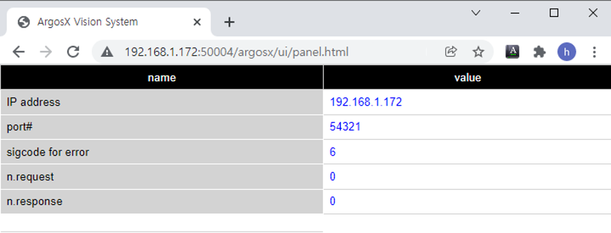

#### 3.4.3 操作监控面板

Python 代码已经包含了 IP 地址、端口号和错误分配输入号码的变量。

由于需要管理请求计数和响应计数，我们需要添加 n_req 和 n_res 变量，如下所示，并将它们连接起来以确保它们可以在 get_general( ) 函数中一起返回。

setup.py
``` python 
前面的步骤被跳过...
 
 
def get_general() -> dict:
   """
   返回：
      设置字典。
   """
 
   print('get_general()')
    
   ret = {}
   ret["ip_addr"] = ip_addr
   ret["port"] = port
   ret["sigcode_err"] = sigcode_err
   ret["n_req"] = n_req
   ret["n_res"] = n_res
    
   return ret
 
 
跳过...
 
 
gen_def = get_general_def()
ip_addr : str = gen_def['ip_addr']
port : int = gen_def['port']
sigcode_err = gen_def['sigcode_err']
n_req = 0   # 请求计数
n_res = 0   # 响应计数
```

将 n_requ 和 n_res 的计数操作添加到机器人语言命令的实现中。

roblang.py
```python 
前面的步骤被跳过...
 
 
def req(work_no: int) -> int:
   """
   发送请求命令到 ArgosX
   例如：“req 39”
   参数：
      work_no     工作#    1~100
 
 
   返回：
         >=0   发送的字节数
         -1    没有 socket。应该调用 init()。
   """
   msg = "req " + str(work_no)
   setup.n_req += 1                           # <---------- 添加
   return comm.send_msg(msg)
 
 
跳过...
 
 
def _res_cont(addr_on_timeout: int_or_str) -> str:
   """cont模式下的res()实现"""
   val = 0
   msg = ""
   timeout = _check_timeout_and_branch(addr_on_timeout)
   if timeout:
      val = 1
   else:
      msg = comm.recv_msg()
      print(msg)
      if msg=="res fail":
         val = 1
         msg = ""
      elif msg=="":
         xhost.req_to_continue()
      else:
         msg = get_base_shift_array_from_res(msg)
         setup.n_res += 1                    # <---------- 添加
   xhost.io_set_out_bit(setup.sigcode_err, val)
   return msg
```
将以下内容写入 ui/panel.js 文件。该内容是关于每 500 毫秒调用一次 updateData( ) 函数，从主板获取所有常规数据，并通过 display( ) 函数将它们注入到 html 屏幕中。

ui/panel.js
``` js

///@作者: Jane Doe, BlueOcean Robot & Automation, Ltd.
///@简介: ArgosX 视觉系统接口 - 面板
///@创建: 2021-12-07
 
 
 
function init()
{
   updateData();
   setInterval('updateData()', 500);
}
 
 
///@简介
function updateData()
{
   var path = '/apps/argosx/svr_general';
   var url = domainMb()+path;
   $.get(url, function(data) {
      display(data);
   });
}
 
 
///@返回     例如 "http://192.168.1.150:8888"
function domainMb()
{
   var domain = "http://" + window.location.hostname + ":8888";
   console.log(domain);
   return domain;
}
 
 
///@参数[in]  data
///@简介      （回调函数）表单 <- data
function display(data)
{
   console.log(data);
 
   $('#ip_addr').text(data.ip_addr);
   $('#port').text(data.port);
   $('#sigcode_err').text(data.sigcode_err);
   $('#n_req').text(data.n_req);
   $('#n_res').text(data.n_res);
}
```
再次运行虚拟控制器，然后在 vscode 上再次执行 Go Live。现在，您可以在网页浏览器的屏幕上看到如下打印的值。

让我们通过执行 ArgosX 存根并使用虚拟教学 pendant 运行作业程序来执行请求和响应。如果 n.request 和 n.response 的值增加，这意味着操作正常。
<br></br>
