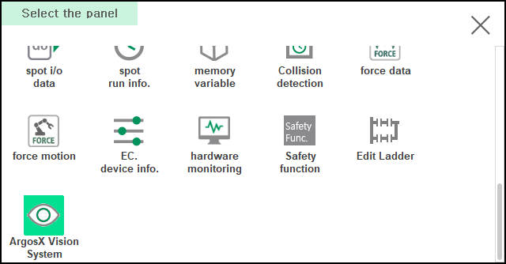
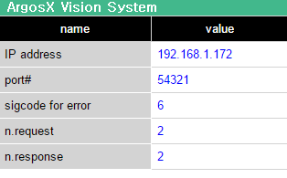

#### 3.4.4 将面板项目注入面板菜单

让我们将 ArgosX 监控功能注入到面板菜单中。

按照以下方式在 ui/menu.json 文件中添加面板项目。

menu.json
``` json
[
   {
       "path": "system/appl/",
       "id": "argosx",
       "icon": "argosx/ui/lm_argosx.png",
       "label": "ArgosX Vision",
       "url": "argosx/ui/setup.html"
   },
   {
      "path": "panels",
      "id": "argosx",
      "icon": "argosx/ui/panel_argosx.png",
      "label": "ArgosX Vision",
      "url": "argosx/ui/panel.html"
  }
]
```

让我们制作一个将注入到面板菜单中的图片图标。一个透明的 40 x 40 像素背景的 png 图标就足够了。

在这里，我们通过适当缩小现有的 lm_argosx.png 并调整颜色，制作了 panel_argosx.png。


panel_argosx.png 的示例（您可以下载并使用此图片。）

现在，让我们运行虚拟主板和虚拟编程手柄。

当您打开面板菜单以添加新的面板项目时，您可以看到新添加的 ArgosX Vision 菜单项。


当您选择菜单时，我们制作的监控面板将很快出现。
<br></br>

通过操作虚拟教学挂件来执行请求和响应。如果 n.request 和 n.response 值增加，则表示操作正常。