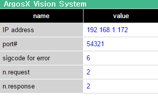

# 3.4.4 Injecting a panel item into the panel menu

Let's inject the ArgosX monitoring function into the panel menu.

Add a panel item into the ui/menu.json file as follows.

menu.json
``` json
[
   {
       "path": "system/appl/",
       "id": "argosx",
       "icon": "argosx/ui/lm_argosx.png",
       "label": "ArgosX Vision",
       "url": "argosx/ui/setup.html"
   },
   {
      "path": "panels",
      "id": "argosx",
      "icon": "argosx/ui/panel_argosx.png",
      "label": "ArgosX Vision",
      "url": "argosx/ui/panel.html"
  }
]
```

Let’s make a picture icon that will be injected into the panel menu. A png icon with a transparent 40 x 40-pixel background would be sufficient.

Here, we just made panel_argosx.png by scaling down the existing lm_argosx.png properly and adjusting the colors.


Example of panel_argosx.png (you can download and use this picture.)


Now, let's run the virtual mainboard and virtual teach pendant.


When you open the panel menu to add a new panel item, you can see the newly added ArogsX Vision menu item.


When you select the menu, the monitoring panel we made will appear shortly.
<br></br>



Let's execute requests and responses by operating the virtual teach pendant. If the n.request and n.response values increase, it means the operation is normal.

