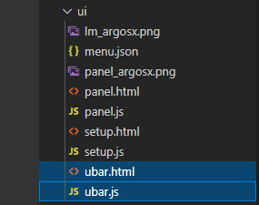
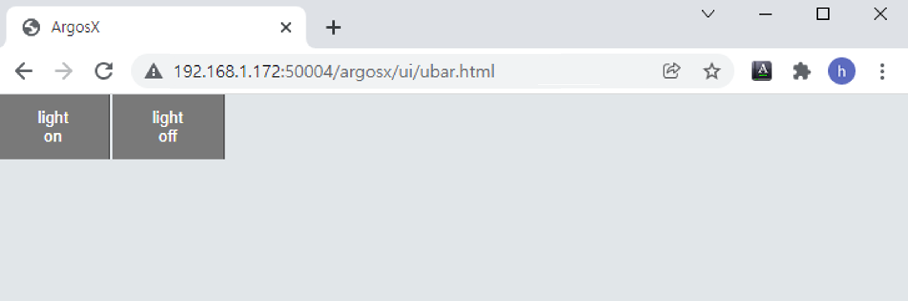

#### 3.5.2 用户栏布局

打开 vscode，定位到 ArgosX 文件夹的父级 apps/ 文件夹。

创建 ui/ubar.html 和 ui/ubar.js 文件。
<br>

编写以下内容，关于由两个按钮组成的简单布局。表格的第一列被赋予一个名为 'ubar-bt' 的类，该类在 common style.css 中定义。它会自动识别 TP600 和 TP630，并使按钮的大小和颜色类似于默认 UI。如果您想更改样式，可以使用单独的本地 css 定义一个类并应用它。

ubar.html
``` html
<!DOCTYPE html:5>
<!--
   @author: Jane Doe, BlueOcean Robot & Automation, Ltd.
   @brief: ArgosX Vision System interface - bar
   @create: 2021-12-07
-->
<html>
  
<head>
    <title>ArgosX</title>
    <link rel='stylesheet' href='../../_common/css/style.css' type=text/css rel=stylesheet>
    <script src='../../_common/js/jquery-3.6.0.min.js'></script>
    <script src='./ubar.js'></script>
</head>
  
<body class='ubar'>
   <button id='light-on' class='ubar-bt' onclick='light_onoff(true);'>light<br>on</button>
   <button id='light-off' class='ubar-bt' onclick='light_onoff(false);'>light<br>off</button>
</body>
</html>
```

当 ubar.html 打开时，如果您通过点击右下角的 Go Live 按钮执行 Live server，Google Chrome 浏览器将打开。
<br>

尽管 ubar.js 目前没有内容，但我们可以检查布局是否正常。
<br>