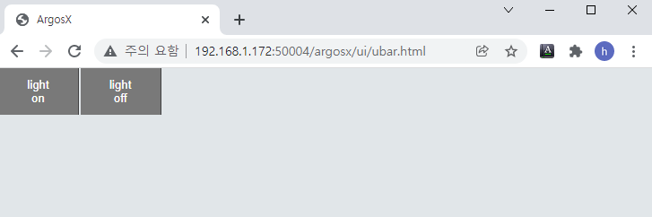
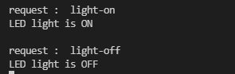

# 3.5.3 사용자 막대의 동작

## 클라이언트단 (티치펜던트)


ui/ubar.js 파일에 아래와 같이 작성합니다. 버튼을 누를 때마다 티치펜던트는 "light_onoff"라는 HTTP post 메시지를 메인보드로 송신합니다. on인지 off인지는 onoff라는 속성을 가진 객체에 담아, post 메시지의 body에 실어 보냅니다.

- light-on일 때의 body : { onoff: true }
- light-off일 때의 body : { onoff: false }


ui/ubar.js
``` js
///@author: Jane Doe, BlueOcean Robot & Automation, Ltd.
///@brief: ArgosX Vision System interface - setup general
///@create: 2021-12-07
 
 
 
///@return     e.g. "http://192.168.1.150:8888"
function domainMb()
{
   var domain = "http://" + window.location.hostname + ":8888";
   console.log(domain);
   return domain;
}
 
 
///@param[in]  onoff    true or false
///@return
///      -  0     ok
///@brief      request light-on/off
function light_onoff(onoff)
{
   var url = domainMb()+"/apps/argosx/svr_light_onoff";
   var args = { onoff: onoff };
 
   args = JSON.stringify(args);
   $.ajax({
      url: url,
      type: 'post',
      dataType: 'json',
      contentType : "application/json; charset=utf-8",
      data: args,
      success: function(res) {
         console.log('success' + res);
      },
      error : function(res) {
         console.log('error' + res);
      }
   });
 
   return 0;
}
```


## 서버단 (메인보드)


이제 메인보드의 argosx 플러그인에서 이 메시지를 받아 실제 ArgosX 장치(stub로 실험)로 "light-on", "light-off" 메시지를 보내주면 됩니다.


argosx/ 폴더에 ubar.py 파일을 아래와 같이 작성합니다. 구현 내용은 이전 챕터의 callback에서 구현한 것과 비슷하게 comm_ex 모듈을 활용합니다.
``` python
""" ArgosX Vision System interface - main
 
 
@author:    Jane Doe, BlueOcean Robot & Automation, Ltd.
@created:   2021-12-07
"""
 
 
from . import comm_ex
 
 
def post_light_onoff(body: dict) -> int:
   """
   Args:
      onoff
    
   Returns:
      0
   """
   onoff = body['onoff']
   msg = 'light-' + ('on' if onoff else 'off')
   print(msg)
       
   return comm_ex.send_msg_once(msg)
```

마지막으로, main.py에 ubar.py의 모든 함수를 import 해줍니다.


main.py
``` python
""" ArgosX Vision System interface - main
 
 
@author:    Jane Doe, BlueOcean Robot & Automation, Ltd.
@created:   2021-12-06
"""
 
from . import setup
from .roblang import *
from .setup import *
from .callback import *
from .ubar import *
 
import xhost
 
 
이후 생략...
```

가상제어기를 재부팅한 후, job 파일을 argosx.init( )까지 실행합니다. 다시 Go Live를 실행하여 웹브라우저에 사용자 막대 화면을 띄웁니다.

ArgosX stub를 실행하고 웹 브라우저의 버튼을 조작해봅니다. stub의 콘솔 출력에 "light-on", "light-off" 수신이 표시되면 정상입니다.
<br>



ArgosX stub 콘솔 출력
<br>



