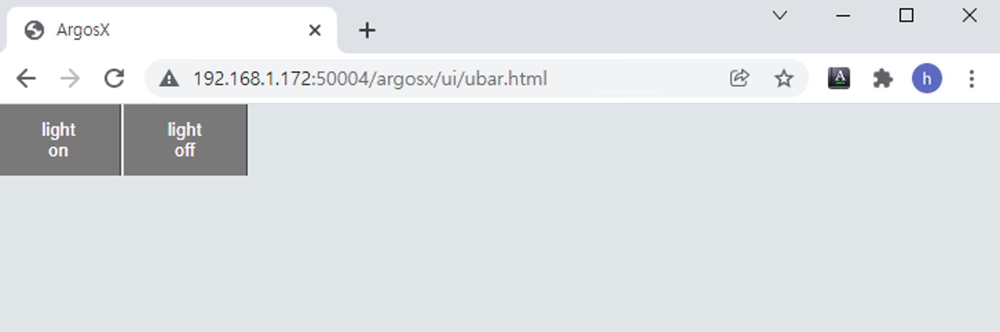
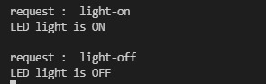

#### 3.5.3 操作用户工具条

##### 客户端 (教学挂件)

在 ui/ubar.js 文件中写入以下内容。每次按下按钮时，教学挂件将会向主板发送一个名为 "light_onoff" 的 HTTP post 消息。开或关的状态将包含在一个具有 onoff 属性的对象中，并将加载到 post 消息的主体中发送。

- 灯光开启状态的主体: { onoff: true }
- 灯光关闭状态的主体: { onoff: false }

ui/ubar.js
``` js
///@author: Jane Doe, BlueOcean Robot & Automation, Ltd.
///@brief: ArgosX Vision System interface - setup general
///@create: 2021-12-07
 
 
 
///@return     e.g. "http://192.168.1.150:8888"
function domainMb()
{
   var domain = "http://" + window.location.hostname + ":8888";
   console.log(domain);
   return domain;
}
 
 
///@param[in]  onoff    true or false
///@return
///      -  0     ok
///@brief      请求灯光开/关
function light_onoff(onoff)
{
   var url = domainMb()+"/apps/argosx/svr_light_onoff";
   var args = { onoff: onoff };
 
   args = JSON.stringify(args);
   $.ajax({
      url: url,
      type: 'post',
      dataType: 'json',
      contentType : "application/json; charset=utf-8",
      data: args,
      success: function(res) {
         console.log('success' + res);
      },
      error : function(res) {
         console.log('error' + res);
      }
   });
 
   return 0;
}
```

##### 服务器端 (主板)

现在，主板的 ArgosX 插件需要接收此消息并向实际的 ArgosX 设备发送 "light-on" 和 "light-off" 消息（使用桩进行测试）。

将 ubar.py 文件写入 argosx/ 文件夹，如下所示。关于其实现，将使用 comm_ex 模块，类似于我们在先前章节中执行的回调实现。
``` python
""" ArgosX Vision System interface - main
 
 
@author:    Jane Doe, BlueOcean Robot & Automation, Ltd.
@created:   2021-12-07
"""
 
 
from . import comm_ex
 
 
def post_light_onoff(body: dict) -> int:
   """
   参数:
      onoff
    
   返回:
      0
   """
   onoff = body['onoff']
   msg = 'light-' + ('on' if onoff else 'off')
   print(msg)
       
   return comm_ex.send_msg_once(msg)
```

最后一步，将 ubar.py 的所有函数导入 main.py。

main.py
``` python
""" ArgosX Vision System interface - main
 
 
@author:    Jane Doe, BlueOcean Robot & Automation, Ltd.
@created:   2021-12-06
"""
 
from . import setup
from .roblang import *
from .setup import *
from .callback import *
from .ubar import *
 
import xhost
 
 
后续步骤略去...
```

重启虚拟控制器，然后运行作业文件直到 argosx.init( )。再次执行 Go Live 以在网络浏览器上调出用户工具条屏幕。

执行 ArgosX 桩，然后在网络浏览器上操作按钮。如果桩的控制台输出显示为 "light-on" 和 "light-off"，则意味着操作正常。
<br>


ArgosX 桩的控制台输出
<br>
