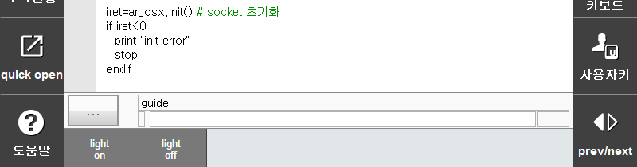

# 3.5.4 Injecting a user bar

Let's inject the ArgosX user bar into the actual teach pendant.


Add the "ubars" path item into the ui/menu.json file, as shown below. 


menu.json
``` json
[
    {
         "path": "system/appl/",
         "id": "argosx",
         "icon": "argosx/ui/lm_argosx.png",
         "label": "ArgosX Vision",
         "url": "argosx/ui/setup.html"
    },
    {
        "path": "panels",
        "id": "argosx",
        "icon": "argosx/ui/panel_argosx.png",
        "label": "ArgosX Vision",
        "url": "argosx/ui/panel.html"
    },
    {
        "path": "ubars",
        "id": "argosx",
        "url": "argosx/ui/ubar.html"
    }
]
```

Pressing the User Key button on the right side of the virtual teach pendant will bring up the user bars of the installed applications in sequence. Now you can also see the user bar we created for ArgosX. Operate the buttons to check whether the ArgosX stub responds normally.




