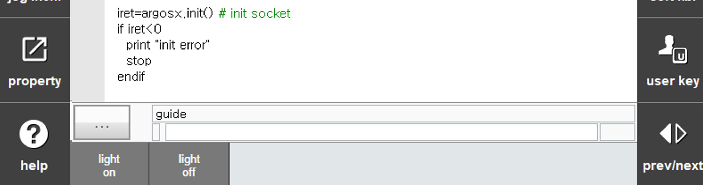

#### 3.5.4 注入用户工具条

让我们将 ArgosX 用户工具条注入到实际的教学挂件中。

将 "ubars" 路径项添加到 ui/menu.json 文件中，如下所示。

menu.json
``` json
[
    {
         "path": "system/appl/",
         "id": "argosx",
         "icon": "argosx/ui/lm_argosx.png",
         "label": "ArgosX 视觉",
         "url": "argosx/ui/setup.html"
    },
    {
        "path": "panels",
        "id": "argosx",
        "icon": "argosx/ui/panel_argosx.png",
        "label": "ArgosX 视觉",
        "url": "argosx/ui/panel.html"
    },
    {
        "path": "ubars",
        "id": "argosx",
        "url": "argosx/ui/ubar.html"
    }
]
```

按下虚拟教学挂件右侧的用户键按钮将依次显示安装的应用程序的用户工具条。现在你也可以看到我们为 ArgosX 创建的用户工具条。操作按钮以检查 ArgosX 桩是否正常响应。

