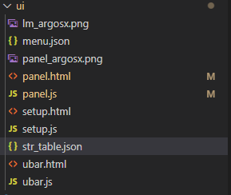
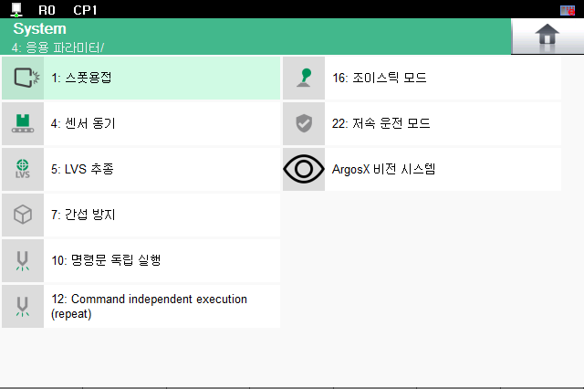

# 3.6.1.1 설정화면 메뉴의 번역 

## string table의 등록
다국어화의 리소스 등록을 위하여 string table을 등록해야합니다.
이는 json 형태로 등록을 해야하며 하기의 형식으로 추가가 되어야합니다.

1) argosx 프로젝트의 ui 폴더 내에 str_table.json 파일 추가

    

2) 내용
    ``` json
    {
          "en":
        {
            "IDS_title" : "ArgosX Vision System"
        },
        "ko": 
        {
            "IDS_title" : "ArgosX 비전 시스템"
        }
    }
    ```

    "en"과 "ko"는 Hi6 와 통용되는 language code(이하 langcode) 이며, "en"은 English 영어, "ko"는 Korean 한국어를 의미합니다.

    각 langcode 별로 str 데이터의 id 와 string value 값의 멤버들을 가집니다.

    menu에서 제목을 추가하기 위해여 "IDS_title"이라는 동일한 id를 가진 string data들을 각각 "en"과 "ko"에 형식에 맞춰 추가해줍니다.

## 메뉴의 주입
메뉴에서 설정화면의 라벨을 확인하기 위해서 id를 추가해줍니다.

1) info.json
   
    기존에 작성되어 있던 info.json의 내용을 변경해봅시다.
    
    생성한 str_table.json 파일을 "strs" id의 값으로 추가 해줍니다. 
    
    ``` json
    {
	    "author" : "BlueOcean Robot & Automation, Ltd.",
	    "binding" : "plug-in",
	    "cmds" : "cmds.json",
	    "copyright" : "All right reserved",
	    "description" : "ArgosX Vision System interface",
	    "entry" : "main.py",
	    "menu" : "ui/menu.json",
	    "strs" : "ui/str_table.json",
	    "startup" : "boot",
	    "version" : "v0.9.0"
    }
    ```
2) menu.json
    
    기존에 작성되어 있던 menu.json의 내용을 변경해봅시다.

    ``` json
        {
            "path": "system/appl/",
            "id": "argosx",
            "icon": "argosx/ui/lm_argosx.png",
            "label": "IDS_title",
            "url": "argosx/ui/setup.html"
        }
    ```
    label의 값을 기존의 "ArgosX Vision System"이 아닌 "IDS_title"로 작성해 줍니다.

3) 언어 선택

    가상 제어기 환경에서는 hi6tp_platform_cfg.json의 "lang_code" 내용을 변경해야 합니다.

    ``` json
    "lang_code": "ko"
    ```
    위와 같이 lang_code를 변경 한 뒤에 제어기와 tp를 재실행하여 변경된 언어와 메뉴 라벨을 확인합니다.

    정상적으로 반영이 되었다면 아래와 같이 메뉴에서 한글로 표기되어야합니다.
    
    

