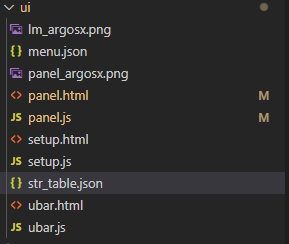
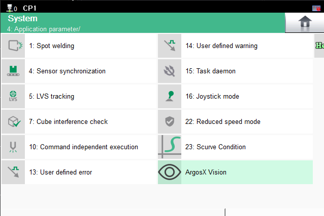

#### 3.6.1.1 翻译设置屏幕菜单

##### 注册字符串表

要注册本地化资源，您必须创建一个字符串表。  
它必须以 JSON 格式注册，并按如下所示添加。

1) 在 argosx 项目的 ui 文件夹中添加文件 str_table.json。

    

2) 内容

```json
{
    "en":
    {
        "IDS_title" : "ArgosX Vision System"
    },
    "zh":
    {
        "IDS_title" : "ArgosX 视觉系统"
    }
}
````

"en" 和 "zh" 是与 ${cont_model} 兼容的语言代码（以下简称 langcode）。
"en" 代表英语，而 "zh" 代表中文。

每个 langcode 包含由字符串 id 和其对应字符串值组成的成员。

要在菜单中添加标题，请按照上述格式将相同 id "IDS_title" 的字符串数据添加到 "en" 和 "zh" 中。

<br>

##### 翻译菜单标签

设置屏幕菜单上的标签也必须翻译。

请遵循以下步骤：

1. info.json

修改现有的 info.json 文件。

将创建的 str_table.json 文件作为 "strs" id 的值添加。

```json
{
    "author" : "BlueOcean Robot & Automation, Ltd.",
    "binding" : "plug-in",
    "cmds" : "cmds.json",
    "copyright" : "All right reserved",
    "description" : "ArgosX Vision System interface",
    "entry" : "main.py",
    "menu" : "ui/menu.json",
    "strs" : "ui/str_table.json",
    "startup" : "boot",
    "version" : "v0.9.0"
}
```
2. menu.json

修改现有的 menu.json 文件。

```json
{
    "path": "system/appl/",
    "id": "argosx",
    "icon": "argosx/ui/lm_argosx.png",
    "label": "IDS_title",
    "url": "argosx/ui/setup.html"
}
```

将标签值设置为 "IDS_title"，而不是固定文本 "ArgosX Vision System"。

<br>

3. 语言选择

在虚拟控制器环境中，您必须修改 hi6tp_platform_cfg.json 中的 "lang_code" 值。

```json
"lang_code": "en"
```

更改 lang_code 后，重新启动控制器和 TP，以验证更新的语言和菜单标签。

如果应用正确，菜单现在应该以韩语显示。

